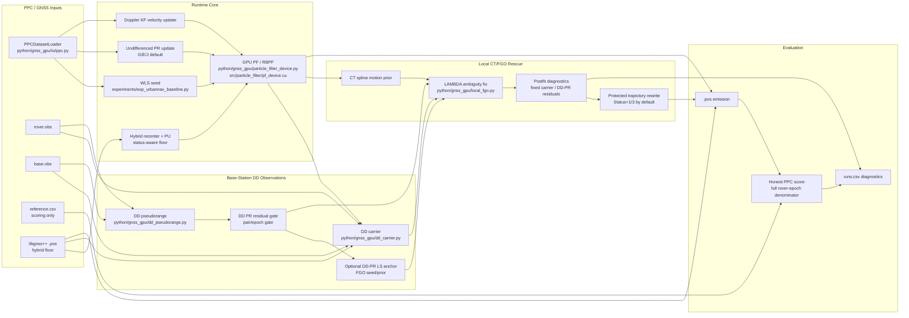
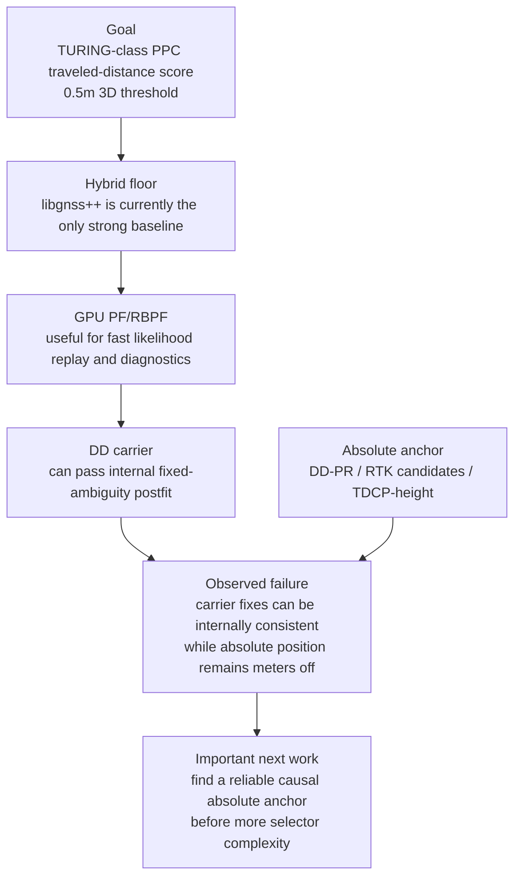

# gnss_gpu

`gnss_gpu` is a CUDA-backed GNSS positioning repo built around experiment-first development. The repository contains reusable core code under `python/gnss_gpu/`, but a large part of the current value is the evaluation stack around UrbanNav, PPC-Dataset, and real-PLATEAU subsets.

This repo is no longer in a "pick one perfect architecture first" phase. The current workflow is:

1. build comparable variants under the same contract
2. evaluate them on fixed splits and external checks
3. freeze only the parts that survive
4. keep rejected or supplemental ideas in `experiments/`, not in the core API

## Current Architecture Map

The current PPC work has two different layers that should not be confused:

- The **core positioning path** should stay small: PPC data loading, GPU PF/RBPF, hybrid floor, DD/FGO rescue, scoring.
- The **diagnostic path** is allowed to be large: candidate selectors, label policies, oracle probes, local sweeps, and failure-regime audits.



### PPC CT/PF/FGO Read

This is the current working interpretation of the PPC branch:



In short: if PPC performance is poor, more selector machinery is not automatically the right answer. The key technical question is whether the stack has a reliable causal absolute anchor for the weak hybrid regions. DD carrier alone is relative; DD pseudorange can be useful after gating, but is still meter-class on the hard Nagoya block.

### Current RTKDiag Lowcase Policy

`phase11er` is the current conservative RTKDiag rescue policy for the hard `nagoya/run2` lowcase. It is intentionally narrow:

- `nagoya/run2` only: residual selection over a seven-candidate stack, candidate emission, hybrid fallback, and a 10 m candidate-to-hybrid gate.
- all other runs: candidates are blocked so the RTKDiag variant is a hybrid passthrough.

The verified p2k aggregate is:

| scope | hybrid | phase11er | delta |
| --- | ---: | ---: | ---: |
| 6-run honest p2k | 14.224688% | 14.354783% | +0.130095pp |
| `nagoya/run2` segment p2k | 45.322161% | 50.785987% | +5.463826pp |

Five nearby `nagoya/run2` 200-epoch windows also matched the manual gate10 experiment exactly: aggregate segment PPC `39.881723% -> 47.775553%` with zero regressions. The key result file is `experiments/results/ppc_phase11er_policy_all_p2k_runs.csv`; future reruns should use `--rtkdiag-candidate-run-index-policy phase11er`.

## Visual snapshot

| Main result (UrbanNav external) | Particle scaling (100 to 1M) |
| --- | --- |
|  |  |

| BVH runtime (57.8x speedup) | PPC holdout (design discipline) |
| --- | --- |
|  |  |

## Current frozen read

- **PF beats RTKLIB demo5 on all metrics**: P50 1.36m vs 2.67m (49%), RMS 4.11m vs 13.08m (69%) on Odaiba
- DD carrier phase AFV + DD pseudorange with base station, forward-backward smoother
- IMU stop-detection with dynamic sigma_pos for 100% IMU utilization
- GNSS corrections: [gnssplusplus-library](https://github.com/rsasaki0109/gnssplusplus-library) (Sagnac, tropo, iono, TGD, ISB)
- Clock bias correction: per-epoch re-centering from pseudorange residuals — enables cross-receiver robustness
- Scaling: phase transition at N≈1,000, tail improvement up to 1M particles
- Systems: `PF3D-BVH-10K` — 57.8x runtime reduction

### PF vs RTKLIB demo5 (Odaiba, dual-frequency Trimble, gnssplusplus corrections)

| Method | P50 | P95 | RMS 2D | >100 m |
| --- | ---: | ---: | ---: | ---: |
| RTKLIB demo5 | 2.67 m | 32.41 m | 13.08 m | — |
| SPP (gnssplusplus) | 1.66 m | 12.96 m | 63.25 m | 0.08% |
| **PF 100K (DD + smoother + stop-detect)** | **1.36 m** | — | **4.11 m** | **0.000%** |

PF 100K with DD carrier phase AFV, DD pseudorange, forward-backward smoother, and IMU stop-detection beats RTKLIB demo5 by **69% in RMS and 49% in P50**, with zero catastrophic failures. The full stack includes: DD carrier phase ambiguity-free verification (AFV) with base station, IMU-guided predict with stop-detection dynamic sigma_pos, per-epoch clock bias correction, SPP position-domain update, and elevation/SNR-based satellite weighting. PF uses [gnssplusplus-library](https://github.com/rsasaki0109/gnssplusplus-library) for pseudorange corrections.

### Particle cloud on OpenStreetMap

PF (red) vs RTKLIB demo5 (green dashed) vs Ground truth (blue) on real Tokyo streets.

| Odaiba (moderate urban) | Shinjuku (deep urban canyon) |
| --- | --- |
| [Download mp4](docs/assets/media/particle_viz_odaiba.mp4) | [Download mp4](docs/assets/media/particle_viz_shinjuku.mp4) |

View on [GitHub Pages](https://rsasaki0109.github.io/gnss_gpu/) for inline playback.

For a longer LOS/NLOS sweep with OpenStreetMap basemap, coarse 3D PLATEAU buildings, and
satellites projected onto a virtual sky ceiling, open the
[interactive deck.gl map](docs/assets/media/los_nlos_deckgl.html) or
[download mp4](docs/assets/media/los_nlos_deckgl.mp4). A still preview is at
[los_nlos_deckgl_still.png](docs/assets/media/los_nlos_deckgl_still.png).

### Particle count scaling


PF crosses the RTKLIB demo5 baseline at N≈500 particles on Odaiba. Mean RMS saturates near N=5,000 (~6m on Odaiba with cb correct + position update, ~13m on Shinjuku), with >100m failure rate at 0% for all N≥500. GPU-scale particle inference enables a tail-robustness regime unreachable at conventional particle counts. 1M particles at 9 ms/epoch — well within 1 Hz GNSS budget.

### Cross-geography breadth

**Tokyo (dual-frequency Trimble + G,E,J, DD + smoother; Odaiba best uses IMU stop-detect)**

| Sequence | PF P50 | PF RMS | Baseline | Baseline RMS | PF RMS improvement |
| --- | ---: | ---: | --- | ---: | ---: |
| Odaiba | **1.36 m** | **4.11 m** | RTKLIB demo5 | 13.08 m | **69%** |
| Shinjuku | **2.52 m** | **8.92 m** | gnssplusplus SPP | 18.12 m | **51%** |

PF beats all baselines on both sequences with zero >100m failures.

### Supplemental: Hong Kong (single-frequency ublox)

HK uses a single-frequency ublox M8 receiver (L1 only), which cannot benefit from dual-frequency iono-free combination. Results are included as a supplemental analysis of single-frequency performance.

| Sequence | Method | P50 | P95 | RMS | >100m |
| --- | --- | ---: | ---: | ---: | ---: |
| HK-20190428 | RTKLIB demo5 | 16.18 m | 60.85 m | 26.80 m | 0.2% |
| HK-20190428 | SPP (gnssplusplus) | 15.27 m | 43.72 m | 23.71 m | 0.0% |
| HK-20190428 | **PF 100K** | **14.21 m** | **41.60 m** | **22.53 m** | **0.0%** |

PF beats RTKLIB demo5 by **16% in RMS and 32% in P95** even with single-frequency. Key techniques: per-epoch clock bias correction (compensates ublox ~65 m/s drift), Doppler velocity, RAIM satellite exclusion, elevation/SNR weighting, and carrier phase NLOS detection.

Without clock bias correction, HK PF diverges to >100m on 100% of epochs. Per-epoch cb re-centering is critical for ublox receivers where cb drifts at ~65 m/s (vs ~6 m/s for Trimble).

TST and Whampoa sequences have 20-30 satellites but SPP itself fails (>300m RMS) due to dominant NLOS. These environments require RTK, carrier-phase, or 3D-map-aided NLOS exclusion.

### Supplemental Only: Kaggle GSDC 2023 Submission Benchmark

These are Kaggle leaderboard submission scores on open-sky smartphone data. They are included as a supplemental smartphone benchmark only, not as the main UrbanNav claim.

After the GSDC2023 MATLAB migration work, two separate facts are tracked:

- The MATLAB/reference final CSV can be numerically reproduced by the Python wrapper with `p95=0m`, `max=0m` over `71936` rows. That reproduced CSV matches the MATLAB/reference Kaggle score: **4.056 public / 5.141 private**.
- The best private-floor Python submission family is intentionally different from that MATLAB/reference CSV and scores **3.686 public / 4.710 private**. This is the better leaderboard result, but it is not a MATLAB-reference byte-for-byte final output.

Use `experiments/reproduce_gsdc2023_matlab_reference_final.py --require-exact` when the goal is MATLAB final-output provenance/parity. Use the submit-readiness tooling when the goal is gated Kaggle submission review.

| Submission | Public | Private | Method |
| --- | ---: | ---: | --- |
| MATLAB/reference reproduced final | 4.056 m | 5.141 m | exact final-CSV reproduction from bridge artifacts |
| Current Python private-floor best family | **3.686 m** | **4.710 m** | gated source/patch candidate family, not MATLAB-reference identical |
| historical v1 | 4.207 m | 5.144 m | pseudorange only |
| historical v22 | 4.112 m | 5.200 m | shared TDCP soft-only, no TDCP predict, ultra-conservative gates |

| Train method | Mean P50 | Median P50 | Mean RMS |
| --- | ---: | ---: | ---: |
| WLS (Android baseline) | **2.62 m** | **2.42 m** | **5.14 m** |
| PF-100K | 2.83 m | 2.62 m | 5.36 m |

The current best private-floor Python candidate family is **3.686 m public / 4.710 m private**. The MATLAB/reference final CSV is now reproducible exactly from Python, but it scores **4.056 m public / 5.141 m private**, so MATLAB final-output parity and leaderboard optimization are separate tracks. This section is here to document the smartphone submission result, not to replace the UrbanNav headline.

**BVH systems result (PPC-Dataset PLATEAU subset, separate dataset)**

BVH (Bounding Volume Hierarchy) accelerates the 3D ray-tracing likelihood computation used in the PF3D variant. For each particle-satellite pair, the system traces a ray through PLATEAU 3D building models to determine LOS/NLOS visibility. Without BVH, this requires checking every triangle in the mesh (O(N×K×T) where T=triangles). BVH organizes triangles into a spatial hierarchy, reducing this to O(N×K×log(T)) through hierarchical culling. Accuracy is preserved because BVH is an exact acceleration structure (no approximation).

| Method | Runtime | Speedup |
| --- | ---: | ---: |
| `PF3D-10K` | 1028.29 ms/epoch | baseline |
| `PF3D-BVH-10K` | 17.78 ms/epoch | **57.8x faster** |

### Per-particle NLOS likelihood

In the PF3D variant, each particle independently evaluates whether each satellite signal is LOS or NLOS by ray-tracing from the particle's position to the satellite through 3D building geometry. The per-particle likelihood is a two-component mixture:

```
p(pseudorange | particle, satellite) =
    (1 - p_nlos) × N(residual; 0, σ_los²)     [LOS component]
  + p_nlos       × N(residual; bias, σ_nlos²)  [NLOS component]
```

where `p_nlos` is set by the ray-trace result (high if blocked, `clear_nlos_prob=0.01` if clear), `σ_los` is the LOS noise (~3m), `σ_nlos` is the NLOS noise (~30m), and `bias` is the NLOS positive bias (~15m). This means different particles can disagree on which satellites are blocked, naturally handling the multi-modal posterior in urban canyons. The standard PF variant (without 3D models) uses a simpler Gaussian likelihood with `clear_nlos_prob` to provide robustness without explicit ray-tracing.

### IMU integration + DD carrier phase + smoother

With DD carrier phase AFV, DD pseudorange, IMU-guided predict, IMU stop-detection, and forward-backward smoother:

| Sequence | Method | P50 | RMS | >100m |
| --- | --- | ---: | ---: | ---: |
| Odaiba | RTKLIB demo5 | 2.67 m | 13.08 m | — |
| Odaiba | SPP (gnssplusplus) | 1.66 m | 63.25 m | 0.08% |
| Odaiba | **PF 100K (DD + smoother + stop-detect)** | **1.36 m** | **4.11 m** | **0%** |
| Shinjuku | SPP (gnssplusplus) | 3.01 m | 18.12 m | 0.09% |
| Shinjuku | **PF 100K (DD + smoother)** | **2.52 m** | **8.92 m** | **0%** |

Beats RTKLIB/SPP on RMS (69-51%), eliminates all >100m failures, and beats SPP P50 on Odaiba (1.36m vs 1.66m). The stack combines: (1) DD carrier phase AFV with base station for cm-level observation quality, (2) DD pseudorange for additional constraint, (3) IMU-guided predict with stop-detection dynamic sigma_pos (100% IMU utilization), (4) forward-backward particle smoother, (5) per-epoch clock bias correction, (6) SPP position-domain update, (7) elevation/SNR-based satellite weighting.
### Urban canyon simulation

Controlled simulation with parametric canyon (parallel buildings, ray-traced NLOS). PF advantage increases with NLOS severity.

| Canyon height | NLOS % | WLS RMS | PF RMS | PF+Map RMS | PF gain |
| ---: | ---: | ---: | ---: | ---: | ---: |
| 20 m | 33% | 40.68 m | 12.41 m | 11.45 m | 72% |
| 60 m | 83% | 51.83 m | 11.73 m | 10.09 m | 81% |
| 80 m | 91% | 51.72 m | 7.88 m | **6.47 m** | **87%** |

**PF+Map prior** ([Oh et al. 2004 IROS](http://sonify.psych.gatech.edu/~walkerb/publications/pdfs/2004IROS-mapPrior.pdf) inspired): particles inside building footprints receive near-zero weight, constraining the posterior to the street. Adds 14-18% improvement in deep canyons on top of standard PF.


### What this repo claims

- PF with DD carrier phase + DD pseudorange + smoother + IMU stop-detect beats RTKLIB demo5 by 69% in RMS and 49% in P50 on UrbanNav Tokyo Odaiba.
- PF eliminates catastrophic failures (>100m rate = 0%) through temporal filtering.
- DD carrier phase AFV with base station provides cm-level observation quality without integer ambiguity resolution.
- Forward-backward particle smoother uses future observations to refine past estimates.
- IMU stop-detection with dynamic sigma_pos achieves 100% IMU utilization.
- Per-epoch clock bias correction enables cross-receiver robustness (trimble and ublox).
- On Kaggle GSDC 2023 smartphone data, the current best private-floor Python submission family is 3.686 m public / 4.710 m private, and it is documented only as a supplemental benchmark.
- Particle count scaling reveals a phase transition at N≈1,000 with continued tail improvement to 1M.
- BVH makes real-PLATEAU PF3D runtime practical without changing accuracy.
- Urban canyon simulation confirms PF advantage increases with NLOS severity (87% gain at 91% NLOS).
- gnssplusplus-library as submodule for GNSS corrections.

### What this repo does not claim

- It does not claim a world-first GNSS particle filter.
- It does not claim the same configuration works across all urban environments without tuning.
- It does not claim the Kaggle GSDC submission result is the main headline. That result is supplemental and not directly comparable to the UrbanNav DD+smoother result.

## Repo front door

- GitHub Pages artifact snapshot: `docs/index.html`
- Experiment log: [`internal_docs/experiments.md`](internal_docs/experiments.md)
- Decision log: [`internal_docs/decisions.md`](internal_docs/decisions.md)
- Minimal retained interface: [`internal_docs/interfaces.md`](internal_docs/interfaces.md)
- Working plan / handoff log: [`internal_docs/plan.md`](internal_docs/plan.md)
- Paper-oriented asset outputs: `experiments/results/paper_assets/`

## Quick start

### Build

```bash
pip install .
```

The local weak-DD FGO rescue experiment uses the Python GTSAM bindings:

```bash
pip install -r requirements.txt
```

Or build manually:

```bash
mkdir -p build
cd build
cmake .. -DCMAKE_CUDA_ARCHITECTURES=native
make -j"$(nproc)"
```

If you build extensions manually, copy the generated `.so` files into `python/gnss_gpu/` before running Python-side experiments.

### Run tests

```bash
PYTHONPATH=python python3 -m pytest tests/ -q
```

Freeze checkpoint status:

```text
440 passed, 7 skipped, 17 warnings
```

The remaining warnings are existing `pytest.mark.slow`, `datetime.utcnow()`, and plotting warnings rather than new failures.

## Rebuild artifact outputs

### GitHub Pages snapshot

```bash
python3 experiments/build_githubio_summary.py
```

This rebuilds:

- `docs/assets/results_snapshot.json`
- `docs/assets/data/*.csv`
- `docs/assets/figures/*.png`
- `docs/assets/media/los_nlos_deckgl.html`
- `docs/assets/media/los_nlos_deckgl.gif`
- `docs/assets/media/los_nlos_deckgl.mp4`
- `docs/assets/media/los_nlos_deckgl_still.png`
- `docs/assets/media/los_nlos_deckgl.webm`
- `docs/assets/media/site_poster.png`
- `docs/assets/media/site_teaser.gif`
- `docs/assets/media/site_teaser.mp4`
- `docs/assets/media/site_teaser.webm`
- `docs/assets/media/site_urbannav_runs.png`
- `docs/assets/media/site_window_wins.png`
- `docs/assets/media/site_hk_control.png`
- `docs/assets/media/site_urbannav_timeline.png`
- `docs/assets/media/site_error_bands.png`

### GitHub Pages smoke test

```bash
npm install
npx playwright install chromium
npm run site:smoke
```

This checks the built snapshot page on desktop and mobile Chromium, asserts that the main sections render, and fails on non-ignored browser runtime errors.

### Paper-facing figures and main table

```bash
python3 experiments/build_paper_assets.py
```

This rebuilds:

- `experiments/results/paper_assets/paper_main_table.csv`
- `experiments/results/paper_assets/paper_main_table.md`
- `experiments/results/paper_assets/paper_ppc_holdout.png`
- `experiments/results/paper_assets/paper_urbannav_external.png`
- `experiments/results/paper_assets/paper_bvh_runtime.png`
- `experiments/results/paper_assets/paper_captions.md`
- `experiments/results/paper_assets/paper_particle_scaling.png`

## Reproduce the current headline result

UrbanNav external evaluation (PF+RobustClear-10K with self-corrections):

```bash
PYTHONPATH=python python3 experiments/exp_urbannav_fixed_eval.py \
  --data-root /tmp/UrbanNav-Tokyo \
  --runs Odaiba,Shinjuku \
  --systems G,E,J \
  --urban-rover trimble \
  --n-particles 10000 \
  --methods EKF,PF-10K,PF+RobustClear-10K,WLS,WLS+QualityVeto \
  --quality-veto-residual-p95-max 100 \
  --quality-veto-residual-max 250 \
  --quality-veto-bias-delta-max 100 \
  --quality-veto-extra-sat-min 2 \
  --clear-nlos-prob 0.01 \
  --isolate-methods \
  --results-prefix urbannav_fixed_eval_external_gej_trimble_qualityveto
```

Main output files:

- `experiments/results/urbannav_fixed_eval_external_gej_trimble_qualityveto_summary.csv`
- `experiments/results/urbannav_fixed_eval_external_gej_trimble_qualityveto_runs.csv`

## Repo layout

- `python/gnss_gpu/`: reusable library code, bindings, dataset adapters, and core hooks
- `src/`: CUDA/C++ kernels and pybind-facing native implementations
- `experiments/`: experiment-only runners, sweeps, diagnostics, and artifact builders
- `docs/`: experiment log, decisions, interface notes, paper draft, and GitHub Pages source
- `tests/`: unit and regression tests

## Development policy

- Keep stable, reusable code in `python/gnss_gpu/` or `src/`.
- Keep variant-heavy logic in `experiments/` until it survives fixed evaluation.
- Do not promote a method because it wins a pilot split.
- Prefer same-input, same-metric comparisons over new abstractions.
- Record adoption and rejection reasons in [`internal_docs/decisions.md`](internal_docs/decisions.md).

## Result files worth opening first

- `experiments/results/paper_assets/paper_main_table.md`
- `experiments/results/paper_assets/paper_urbannav_external.png`
- `experiments/results/paper_assets/paper_bvh_runtime.png`
- `experiments/results/paper_assets/paper_particle_scaling.png`
- `experiments/results/urbannav_window_eval_external_gej_trimble_qualityveto_w500_s250_summary.csv`
- `experiments/results/pf_strategy_lab_holdout6_r200_s200_summary.csv`
- `experiments/results/urbannav_fixed_eval_hk20190428_gc_adaptive_summary.csv`
- `experiments/results/gsdc2023_eval.csv`
- `experiments/results/gsdc2023_submission_v3.csv`

## License

Apache-2.0
