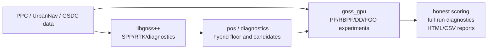

# gnss_gpu

`gnss_gpu` is an experiment-first GNSS positioning workspace. The reusable code
lives under `python/gnss_gpu/` and `src/`; the fast-moving PPC / UrbanNav /
GSDC evaluations live under `experiments/` and `internal_docs/`.

The current repository is not a single polished product yet. Treat it as two
connected layers:

- `third_party/gnssplusplus/`: C++ GNSS/RTK/PPP/CLAS solver and RTK baseline.
- `gnss_gpu`: GPU PF/RBPF, DD observations, local FGO/CT rescue experiments,
  scoring, visualization, and analysis around those solver outputs.

## Current Read

The current PPC production-best route is **Phase71**:

```text
Phase43 official: 85.998294%
Phase71 official: 86.205492%
Delta: +0.207198pp
TURING 85.6% delta: +0.605492pp
```

Phase71 keeps the Phase43 per-run conditional selector setup, then adds an
OSM road-centerline corrected candidate only for `nagoya/run2`. The other five
production runs are unchanged. The large generated OSM candidate and ranker
overlay artifacts are regenerated under `/tmp` by the production script and are
not committed.

The important PPC distinction is now:

- selector/ranker improvements delivered the main jump from the Phase11
  baseline to the Phase43/71 range;
- the remaining gap is dominated by candidate-generation and absolute-source
  failures in hard spans, especially `nagoya/run2`;
- gici-open remains a local reference/source of generated candidates only. Do
  not vendor, link, or derive production code/config from GPL-3.0 sources.

For the latest current-state summary, start with
[`internal_docs/ppc_current_status.md`](internal_docs/ppc_current_status.md).
For the full chronological PPC log, use [`internal_docs/plan.md`](internal_docs/plan.md).
For `libgnss++` RTKLIB demo5 comparisons, use
[`third_party/gnssplusplus/README.md`](third_party/gnssplusplus/README.md) and
[`third_party/gnssplusplus/docs/benchmarks.md`](third_party/gnssplusplus/docs/benchmarks.md).

## Architecture Boundary



Keep durable solver work in `third_party/gnssplusplus` when it belongs to the
C++ GNSS engine. Keep fast experimental replay, candidate selection, GPU
particle filtering, and reporting in this repo.

## Where To Look

- [`python/gnss_gpu/`](python/gnss_gpu/): Python library code, dataset adapters,
  scoring, DD helpers, and GPU-facing APIs.
- [`src/`](src/): CUDA/C++ kernels and native bindings.
- [`experiments/`](experiments/): experiment runners, sweeps, report builders,
  and generated-analysis entry points. See [`experiments/README.md`](experiments/README.md).
- [`experiments/results/`](experiments/results/): CSV/HTML/plot outputs. Many
  files are generated; use [`experiments/results/README.md`](experiments/results/README.md)
  before treating a result as current.
- [`internal_docs/`](internal_docs/): working plans, decisions, negative
  results, handoffs, and longer explanations. See
  [`internal_docs/README.md`](internal_docs/README.md).
- [`docs/index.html`](docs/index.html): generated visual snapshot site.
- [`third_party/gnssplusplus/`](third_party/gnssplusplus/): C++ solver
  subproject and its own docs.

## Current High-Value Threads

- Phase71 production maintenance: keep the n/r2 OSM road candidate
  materialization reproducible without committing large generated artifacts.
- Phase72 exploration: test whether road/map constraints generalize beyond the
  single n/r2 OSM span without perturbing neutral runs.
- Candidate generation: find absolute sources for stable low-residual wrong
  solutions that ranker/consensus logic cannot fix.
- GSDC pivot readiness: keep the PPC work isolated from GSDC reproduction and
  submission artifacts.
- Visualization/reporting: keep HTML reports generic enough to compare
  `gnss_gpu`, `libgnss++`, and RTKLIB-style outputs.

## Quick Start

Install Python package:

```bash
pip install .
```

Install experiment dependencies:

```bash
pip install -r requirements.txt
```

Run tests:

```bash
PYTHONPATH=python python3 -m pytest tests/ -q
```

Build native extensions manually when needed:

```bash
mkdir -p build
cd build
cmake .. -DCMAKE_CUDA_ARCHITECTURES=native
make -j"$(nproc)"
```

If you build extensions manually, copy the generated `.so` files into
`python/gnss_gpu/` before running Python-side experiments.

## Common Commands

Rebuild the generated visual snapshot:

```bash
python3 experiments/build_githubio_summary.py
```

Smoke-test the snapshot site:

```bash
npm install
npx playwright install chromium
npm run site:smoke
```

Rebuild paper-facing summary assets:

```bash
python3 experiments/build_paper_assets.py
```

Run the current `libgnss++` hybrid scorer on existing PPC `.pos` files:

```bash
python3 experiments/exp_ppc_libgnss_hybrid.py \
  --skip-solvers \
  --pos-dir experiments/results/libgnss_rtk_pos_v5 \
  --spp-dir experiments/results/libgnss_spp_pos \
  --results-prefix ppc_compare_libgnss_v5
```

Prepare Phase71 generated artifacts without running the full six-run replay:

```bash
PHASE71_PREP_ONLY=1 bash experiments/scripts_run_phase71_osmroad_production.sh
```

Run the current Phase71 PPC production replay:

```bash
bash experiments/scripts_run_phase71_osmroad_production.sh
```

## Development Policy

- Keep stable reusable code in `python/gnss_gpu/` or `src/`.
- Keep variant-heavy logic in `experiments/` until it survives fixed evaluation.
- Do not promote a method because it wins a pilot split.
- Prefer same-input, same-metric comparisons over new abstractions.
- Record durable decisions in [`internal_docs/decisions.md`](internal_docs/decisions.md),
  current PPC state in [`internal_docs/ppc_current_status.md`](internal_docs/ppc_current_status.md),
  and detailed chronological PPC handoffs in [`internal_docs/plan.md`](internal_docs/plan.md).

## License

Apache-2.0
