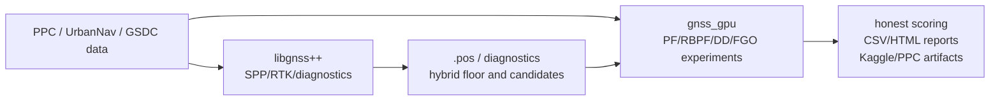

# gnss_gpu

`gnss_gpu` is a research workspace for GNSS positioning experiments. It combines
Python, CUDA/C++, and `libgnss++`-based tooling for:

- GSDC2023 smartphone-decimeter Kaggle submissions.
- PPC / UrbanNav RTK, PF/RBPF, FGO, selector, and map-aided experiments.
- Reusable GNSS helpers under `python/gnss_gpu/` and native kernels under `src/`.

This repository is not a single polished application yet. It is intentionally
experiment-first: stable code lives in the library/native directories, while
fast-moving runs, sweeps, generated reports, and Kaggle/PPC handoffs live in
`experiments/` and `internal_docs/`.

## Start Here

Choose the path that matches what you are trying to do:

| Goal | First place to look |
|---|---|
| Continue current GSDC2023 Kaggle work | [`internal_docs/plan.md`](internal_docs/plan.md) |
| Understand current PPC production state | [`internal_docs/ppc_current_status.md`](internal_docs/ppc_current_status.md) |
| Find durable decisions and negative results | [`internal_docs/decisions.md`](internal_docs/decisions.md) |
| Run or inspect experiment scripts | [`experiments/README.md`](experiments/README.md) |
| Inspect generated result files | [`experiments/results/README.md`](experiments/results/README.md) |
| Work on reusable Python code | [`python/gnss_gpu/`](python/gnss_gpu/) |
| Work on native CUDA/C++ code | [`src/`](src/) |
| Work on the C++ GNSS solver baseline | [`third_party/gnssplusplus/README.md`](third_party/gnssplusplus/README.md) |

## Current Status

As of 2026-05-25 JST, the two most important active threads are:

- **GSDC2023 Kaggle**: current best submitted CSV is v13 TDCP_on_v8 adaptive
  row-gate, with Kaggle `public=3.224` and `private=3.783`.
  The file is
  `experiments/results/gsdc2023_submission_cauchy_pairwise_hampel_accel3_snap_hdg45_kalman_tdcp_onv8_adaptive_rowgate_20260525.csv`.
  A v15 fine row-gate candidate is prepared and documented in
  [`internal_docs/plan.md`](internal_docs/plan.md), but was not submitted at
  the time this note was written.
- **PPC / UrbanNav**: the current production-best route is Phase71. Phase71
  keeps the Phase43 per-run selector setup and adds an OSM road-centerline
  corrected candidate only for `nagoya/run2`.

Keep this section short and current. Put detailed chronology in
[`internal_docs/plan.md`](internal_docs/plan.md), not in the root README.

## Repository Layout

```text
python/gnss_gpu/              Reusable Python package code
src/                          CUDA/C++ kernels and native bindings
experiments/                  Experiment runners, sweeps, reports, one-off probes
experiments/results/          Generated CSV/HTML/plot outputs
internal_docs/                Working notes, decisions, handoffs, current state
docs/                         Generated visual snapshot site
third_party/gnssplusplus/     C++ GNSS/RTK/PPP/CLAS solver subproject
tests/                        Python tests for stable helpers and experiment logic
```

The root-level boundary is:



## Quick Setup

For Python-only development, avoid an editable package install until the native
CUDA/CMake toolchain is ready. Most experiment and test work can run with
`PYTHONPATH=python`.

```bash
python3 -m venv .venv
source .venv/bin/activate
python3 -m pip install --upgrade pip
python3 -m pip install -r requirements.txt
python3 -m pip install pytest pandas scipy requests matplotlib plotly
```

Run a smoke test:

```bash
PYTHONPATH=python python3 -m pytest tests/ -q
```

Build native extensions only when you need CUDA/C++ bindings:

```bash
mkdir -p build
cd build
cmake .. -DCMAKE_CUDA_ARCHITECTURES=native
make -j"$(nproc)"
```

If you build extensions manually, copy the generated `.so` files into
`python/gnss_gpu/` before running Python-side experiments that import them.

## Common Tasks

Read the live project state:

```bash
sed -n '1,220p' internal_docs/plan.md
```

Run the test suite:

```bash
PYTHONPATH=python python3 -m pytest tests/ -q
```

Rebuild the generated visual snapshot:

```bash
python3 experiments/build_githubio_summary.py
```

Smoke-test the snapshot site:

```bash
npm install
npx playwright install chromium
npm run site:smoke
```

Rebuild paper-facing summary assets:

```bash
python3 experiments/build_paper_assets.py
```

Prepare Phase71 generated artifacts without running the full six-run replay:

```bash
PHASE71_PREP_ONLY=1 bash experiments/scripts_run_phase71_osmroad_production.sh
```

Run the current Phase71 PPC production replay:

```bash
bash experiments/scripts_run_phase71_osmroad_production.sh
```

## Data And Artifacts

Many useful files in this workspace are generated, local-only, or too large to
commit. Before trusting a CSV or HTML report, check:

- Whether it is listed in [`experiments/results/README.md`](experiments/results/README.md).
- Whether the matching command is recorded in [`internal_docs/plan.md`](internal_docs/plan.md)
  or another topic-specific note.
- Whether the script is a stable entry point or a one-off probe. The naming
  conventions in [`experiments/README.md`](experiments/README.md) are the best
  quick guide.

## Development Policy

- Keep stable reusable code in `python/gnss_gpu/` or `src/`.
- Keep variant-heavy experiment logic in `experiments/` until it survives fixed
  evaluation.
- Do not promote a method because it wins one pilot split.
- Prefer same-input, same-metric comparisons over new abstractions.
- Record durable decisions in [`internal_docs/decisions.md`](internal_docs/decisions.md).
- Keep current PPC state in
  [`internal_docs/ppc_current_status.md`](internal_docs/ppc_current_status.md).
- Keep detailed chronological handoffs in [`internal_docs/plan.md`](internal_docs/plan.md).
- Do not vendor, link, or derive production code/config from GPL-3.0 reference
  sources such as `gici-open`.

## License

Apache-2.0
