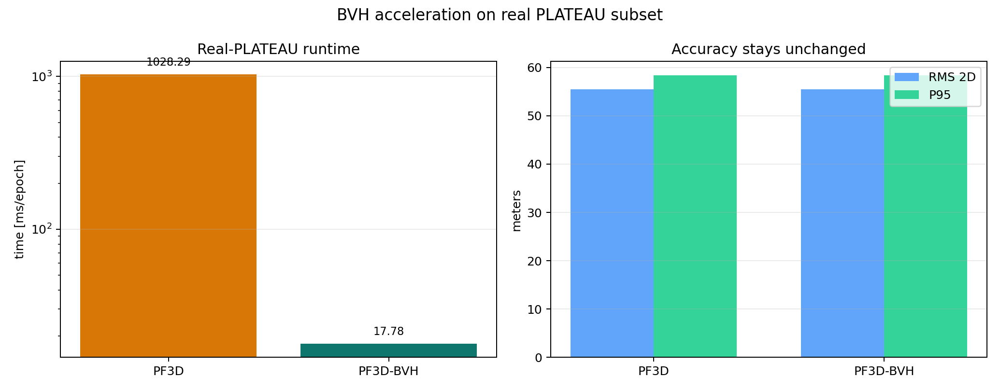
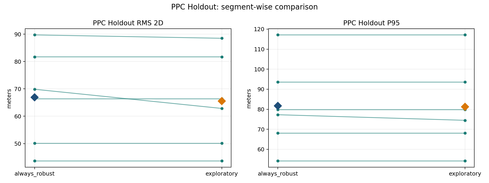
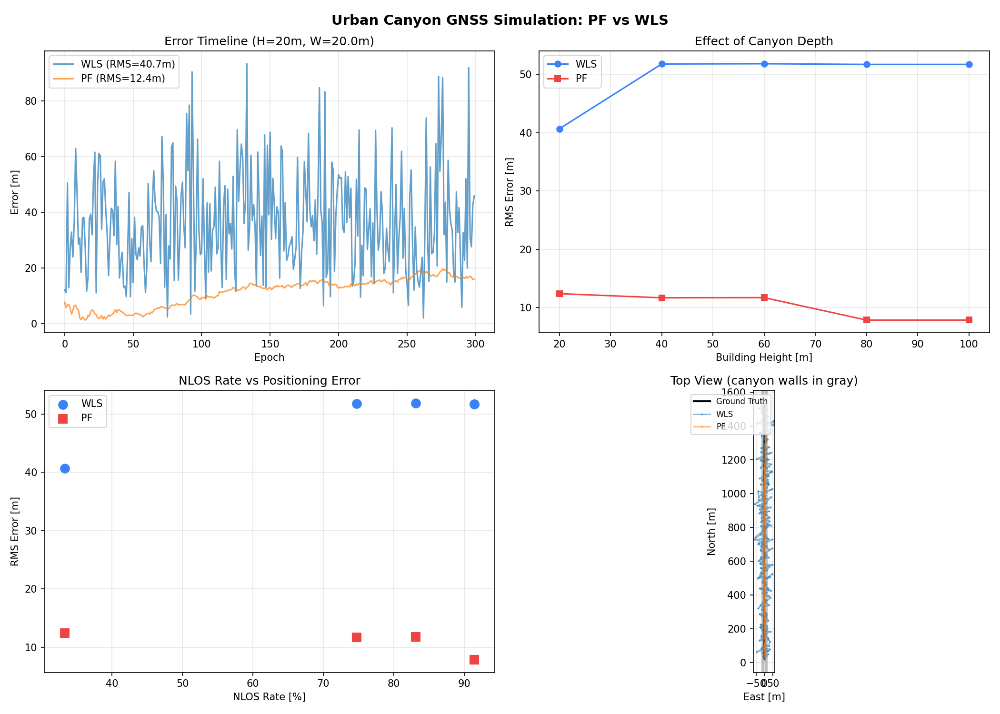

# gnss_gpu

`gnss_gpu` is a CUDA-backed GNSS positioning repo built around experiment-first development. The repository contains reusable core code under `python/gnss_gpu/`, but a large part of the current value is the evaluation stack around UrbanNav, PPC-Dataset, and real-PLATEAU subsets.

This repo is no longer in a "pick one perfect architecture first" phase. The current workflow is:

1. build comparable variants under the same contract
2. evaluate them on fixed splits and external checks
3. freeze only the parts that survive
4. keep rejected or supplemental ideas in `experiments/`, not in the core API

## Visual snapshot

| Main result (UrbanNav external) | Particle scaling (100 to 1M) |
| --- | --- |
|  |  |

| BVH runtime (57.8x speedup) | PPC holdout (design discipline) |
| --- | --- |
|  |  |

## Current frozen read

- **PF beats RTKLIB demo5**: RMS 6.72m vs 13.08m (49% improvement) on Odaiba
- GNSS corrections: [gnssplusplus-library](https://github.com/rsasaki0109/gnssplusplus-library) (Sagnac, tropo, iono, TGD, ISB)
- Cross-geography: PF wins on 5 sequences in 2 cities (Tokyo + Hong Kong)
- Scaling: phase transition at N≈1,000, tail improvement up to 1M particles
- Systems: `PF3D-BVH-10K` — 57.8x runtime reduction

### PF vs RTKLIB demo5 (Odaiba, gnssplusplus corrections)

| Method | P50 | P95 | RMS 2D | >100 m |
| --- | ---: | ---: | ---: | ---: |
| RTKLIB demo5 | 2.67 m | 32.41 m | 13.08 m | — |
| **PF 1M particles** | **3.64 m** | **13.15 m** | **6.72 m** | **0.000%** |

PF beats RTKLIB demo5 by 49% in RMS, 59% in P95, with zero catastrophic failures. RTKLIB wins P50 by 27%. PF uses [gnssplusplus-library](https://github.com/rsasaki0109/gnssplusplus-library) for pseudorange corrections (Sagnac, troposphere, ionosphere, TGD, ISB).

### Particle cloud on OpenStreetMap

PF (red) vs RTKLIB demo5 (green dashed) vs Ground truth (blue) on real Tokyo streets.

| Odaiba (moderate urban) | Shinjuku (deep urban canyon) |
| --- | --- |
| [Download mp4](docs/assets/media/particle_viz_odaiba.mp4) | [Download mp4](docs/assets/media/particle_viz_shinjuku.mp4) |

View on [GitHub Pages](https://rsasaki0109.github.io/gnss_gpu/) for inline playback.

### Particle count scaling


PF crosses the RTKLIB demo5 baseline at N≈500 particles on Odaiba. Mean RMS saturates near N=5,000 (~7m on Odaiba, ~15m on Shinjuku), with >100m failure rate at 0% for all N≥500. GPU-scale particle inference enables a tail-robustness regime unreachable at conventional particle counts. 1M particles at 9 ms/epoch — well within 1 Hz GNSS budget.

### Cross-geography breadth

PF family outperforms baselines across 5 sequences in 2 cities (Tokyo + Hong Kong).

**Tokyo (trimble + G,E,J, gnssplusplus corrections)**

| Sequence | PF RMS | Baseline RMS | Baseline | PF improvement |
| --- | ---: | ---: | --- | ---: |
| Odaiba | **6.72 m** | 13.08 m | RTKLIB demo5 | **49%** |
| Shinjuku | **8.51 m** | 18.12 m | gnssplusplus SPP | **53%** |

**Hong Kong (ublox, gnssplusplus corrections, multi-GNSS nav)**

| Sequence | Sats | PF RMS | SPP RMS | >100m (PF) | Note |
| --- | ---: | ---: | ---: | ---: | --- |
| HK-20190428 | 8 | **24.6 m** | 23.7 m | **0.0%** | GPS+BeiDou |
| HK TST | 20 | 317.6 m | 318.3 m | 78.5% | deep urban, NLOS dominant |
| HK Whampoa | 30 | 503.4 m | 508.7 m | 94.7% | deepest urban canyon |

HK-20190428 achieves sub-25m with multi-GNSS nav (GPS+BeiDou). TST and Whampoa have 20-30 satellites but SPP itself fails (>300m) due to dominant NLOS — this is a fundamental SPP limitation in extreme urban canyons, not a PF issue. RTK or 3D-map-aided methods are needed for these environments.

**BVH systems result (PPC-Dataset PLATEAU subset, separate dataset)**

BVH (Bounding Volume Hierarchy) accelerates the 3D ray-tracing likelihood computation used in the PF3D variant. For each particle-satellite pair, the system traces a ray through PLATEAU 3D building models to determine LOS/NLOS visibility. Without BVH, this requires checking every triangle in the mesh (O(N×K×T) where T=triangles). BVH organizes triangles into a spatial hierarchy, reducing this to O(N×K×log(T)) through hierarchical culling. Accuracy is preserved because BVH is an exact acceleration structure (no approximation).

| Method | Runtime | Speedup |
| --- | ---: | ---: |
| `PF3D-10K` | 1028.29 ms/epoch | baseline |
| `PF3D-BVH-10K` | 17.78 ms/epoch | **57.8x faster** |

### Per-particle NLOS likelihood

In the PF3D variant, each particle independently evaluates whether each satellite signal is LOS or NLOS by ray-tracing from the particle's position to the satellite through 3D building geometry. The per-particle likelihood is a two-component mixture:

```
p(pseudorange | particle, satellite) =
    (1 - p_nlos) × N(residual; 0, σ_los²)     [LOS component]
  + p_nlos       × N(residual; bias, σ_nlos²)  [NLOS component]
```

where `p_nlos` is set by the ray-trace result (high if blocked, `clear_nlos_prob=0.01` if clear), `σ_los` is the LOS noise (~3m), `σ_nlos` is the NLOS noise (~30m), and `bias` is the NLOS positive bias (~15m). This means different particles can disagree on which satellites are blocked, naturally handling the multi-modal posterior in urban canyons. The standard PF variant (without 3D models) uses a simpler Gaussian likelihood with `clear_nlos_prob` to provide robustness without explicit ray-tracing.

### Urban canyon simulation

Controlled simulation with parametric canyon (parallel buildings, ray-traced NLOS). PF advantage increases with NLOS severity.

| Canyon height | NLOS % | WLS RMS | PF RMS | PF+Map RMS | PF gain |
| ---: | ---: | ---: | ---: | ---: | ---: |
| 20 m | 33% | 40.68 m | 12.41 m | 11.45 m | 72% |
| 60 m | 83% | 51.83 m | 11.73 m | 10.09 m | 81% |
| 80 m | 91% | 51.72 m | 7.88 m | **6.47 m** | **88%** |

**PF+Map prior** ([Oh et al. 2004 IROS](http://sonify.psych.gatech.edu/~walkerb/publications/pdfs/2004IROS-mapPrior.pdf) inspired): particles inside building footprints receive near-zero weight, constraining the posterior to the street. Adds 14-18% improvement in deep canyons on top of standard PF.



### What this repo claims

- PF with proper pseudorange corrections beats RTKLIB demo5 by 49% in RMS on UrbanNav Tokyo.
- PF eliminates catastrophic failures (>100m rate = 0%) through temporal filtering.
- Particle count scaling reveals a phase transition at N≈1,000 with continued tail improvement to 1M.
- BVH makes real-PLATEAU PF3D runtime practical without changing accuracy.
- Urban canyon simulation confirms PF advantage increases with NLOS severity (88% gain at 91% NLOS).
- Map prior (Oh et al. 2004) adds 14-18% improvement by constraining particles to road network.
- 24 cited references, gnssplusplus-library as submodule for GNSS corrections.

### What this repo does not claim

- It does not claim a world-first GNSS particle filter.
- It does not claim PF beats iterative WLS in per-epoch median accuracy (P50).
- It does not claim the same configuration works across all urban environments without tuning.

## Repo front door

- GitHub Pages artifact snapshot: `docs/index.html`
- Experiment log: [`internal_docs/experiments.md`](internal_docs/experiments.md)
- Decision log: [`internal_docs/decisions.md`](internal_docs/decisions.md)
- Minimal retained interface: [`internal_docs/interfaces.md`](internal_docs/interfaces.md)
- Working plan / handoff log: [`internal_docs/plan.md`](internal_docs/plan.md)
- Paper-oriented asset outputs: `experiments/results/paper_assets/`

## Quick start

### Build

```bash
pip install .
```

Or build manually:

```bash
mkdir -p build
cd build
cmake .. -DCMAKE_CUDA_ARCHITECTURES=native
make -j"$(nproc)"
```

If you build extensions manually, copy the generated `.so` files into `python/gnss_gpu/` before running Python-side experiments.

### Run tests

```bash
PYTHONPATH=python python3 -m pytest tests/ -q
```

Freeze checkpoint status:

```text
440 passed, 7 skipped, 17 warnings
```

The remaining warnings are existing `pytest.mark.slow`, `datetime.utcnow()`, and plotting warnings rather than new failures.

## Rebuild artifact outputs

### GitHub Pages snapshot

```bash
python3 experiments/build_githubio_summary.py
```

This rebuilds:

- `docs/assets/results_snapshot.json`
- `docs/assets/data/*.csv`
- `docs/assets/figures/*.png`
- `docs/assets/media/site_poster.png`
- `docs/assets/media/site_teaser.gif`
- `docs/assets/media/site_teaser.mp4`
- `docs/assets/media/site_teaser.webm`
- `docs/assets/media/site_urbannav_runs.png`
- `docs/assets/media/site_window_wins.png`
- `docs/assets/media/site_hk_control.png`
- `docs/assets/media/site_urbannav_timeline.png`
- `docs/assets/media/site_error_bands.png`

### GitHub Pages smoke test

```bash
npm install
npx playwright install chromium
npm run site:smoke
```

This checks the built snapshot page on desktop and mobile Chromium, asserts that the main sections render, and fails on non-ignored browser runtime errors.

### Paper-facing figures and main table

```bash
python3 experiments/build_paper_assets.py
```

This rebuilds:

- `experiments/results/paper_assets/paper_main_table.csv`
- `experiments/results/paper_assets/paper_main_table.md`
- `experiments/results/paper_assets/paper_ppc_holdout.png`
- `experiments/results/paper_assets/paper_urbannav_external.png`
- `experiments/results/paper_assets/paper_bvh_runtime.png`
- `experiments/results/paper_assets/paper_captions.md`
- `experiments/results/paper_assets/paper_particle_scaling.png`

## Reproduce the current headline result

UrbanNav external, frozen mainline:

```bash
PYTHONPATH=python python3 experiments/exp_urbannav_fixed_eval.py \
  --data-root /tmp/UrbanNav-Tokyo \
  --runs Odaiba,Shinjuku \
  --systems G,E,J \
  --urban-rover trimble \
  --n-particles 10000 \
  --methods EKF,PF-10K,PF+RobustClear-10K,WLS,WLS+QualityVeto \
  --quality-veto-residual-p95-max 100 \
  --quality-veto-residual-max 250 \
  --quality-veto-bias-delta-max 100 \
  --quality-veto-extra-sat-min 2 \
  --clear-nlos-prob 0.01 \
  --isolate-methods \
  --results-prefix urbannav_fixed_eval_external_gej_trimble_qualityveto
```

Main output files:

- `experiments/results/urbannav_fixed_eval_external_gej_trimble_qualityveto_summary.csv`
- `experiments/results/urbannav_fixed_eval_external_gej_trimble_qualityveto_runs.csv`

## Repo layout

- `python/gnss_gpu/`: reusable library code, bindings, dataset adapters, and core hooks
- `src/`: CUDA/C++ kernels and pybind-facing native implementations
- `experiments/`: experiment-only runners, sweeps, diagnostics, and artifact builders
- `docs/`: experiment log, decisions, interface notes, paper draft, and GitHub Pages source
- `tests/`: unit and regression tests

## Development policy

- Keep stable, reusable code in `python/gnss_gpu/` or `src/`.
- Keep variant-heavy logic in `experiments/` until it survives fixed evaluation.
- Do not promote a method because it wins a pilot split.
- Prefer same-input, same-metric comparisons over new abstractions.
- Record adoption and rejection reasons in [`internal_docs/decisions.md`](internal_docs/decisions.md).

## Result files worth opening first

- `experiments/results/paper_assets/paper_main_table.md`
- `experiments/results/paper_assets/paper_urbannav_external.png`
- `experiments/results/paper_assets/paper_bvh_runtime.png`
- `experiments/results/paper_assets/paper_particle_scaling.png`
- `experiments/results/urbannav_window_eval_external_gej_trimble_qualityveto_w500_s250_summary.csv`
- `experiments/results/pf_strategy_lab_holdout6_r200_s200_summary.csv`
- `experiments/results/urbannav_fixed_eval_hk20190428_gc_adaptive_summary.csv`

## License

Apache-2.0
