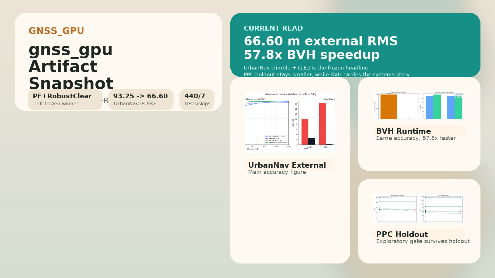
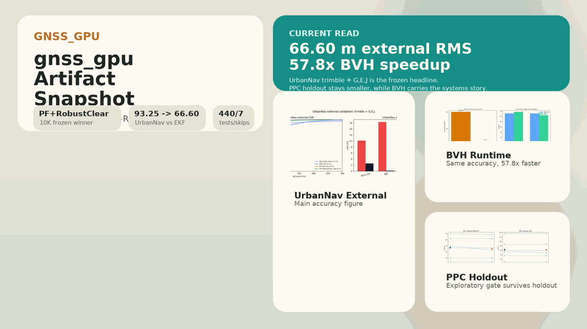
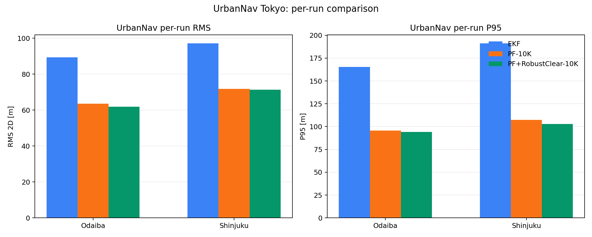
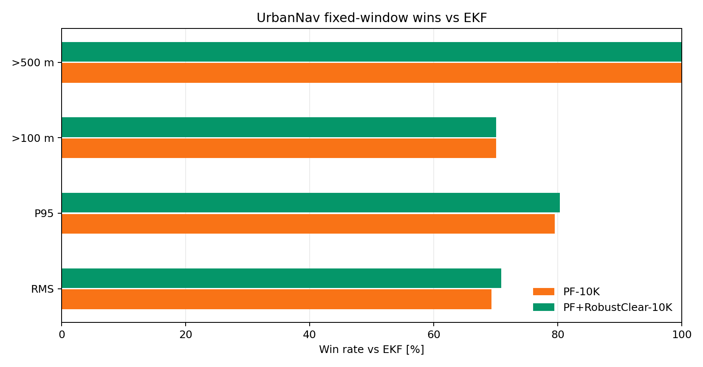
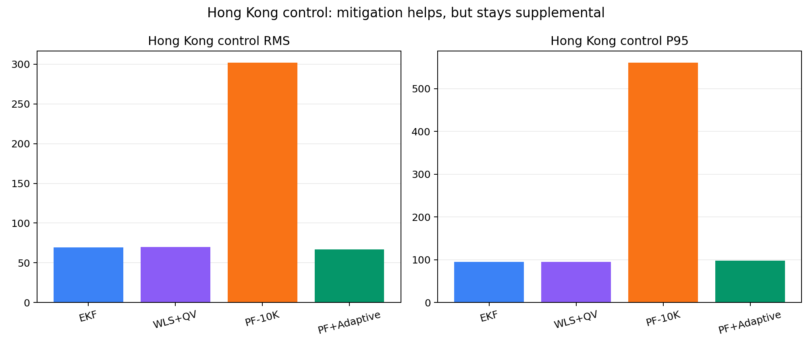
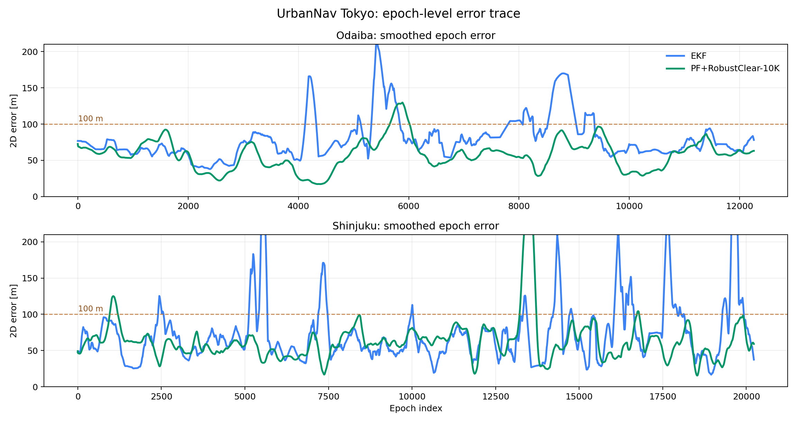
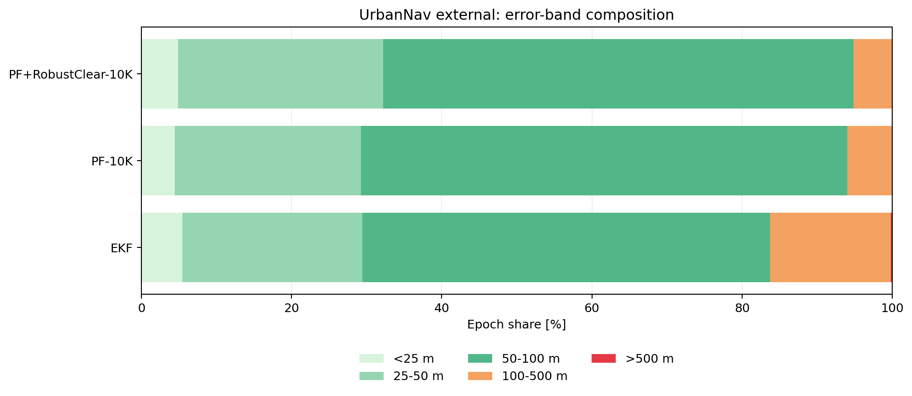

# gnss_gpu

`gnss_gpu` is a CUDA-backed GNSS positioning repo built around experiment-first development. The repository contains reusable core code under `python/gnss_gpu/`, but a large part of the current value is the evaluation stack around UrbanNav, PPC-Dataset, and real-PLATEAU subsets.

This repo is no longer in a "pick one perfect architecture first" phase. The current workflow is:

1. build comparable variants under the same contract
2. evaluate them on fixed splits and external checks
3. freeze only the parts that survive
4. keep rejected or supplemental ideas in `experiments/`, not in the core API

## Visual snapshot





Motion assets:
- [`site_teaser.mp4`](docs/assets/media/site_teaser.mp4)
- [`site_teaser.webm`](docs/assets/media/site_teaser.webm)

| UrbanNav per-run | Window wins vs EKF | Hong Kong control |
| --- | --- | --- |
|  |  |  |

| Epoch error timeline | Error-band composition |
| --- | --- |
|  |  |

## Current frozen read

- Main external method: `PF+RobustClear-10K`
- Main external dataset/result: UrbanNav Tokyo, `trimble + G,E,J`, fixed evaluation
- Cross-geography breadth: Hong Kong 3 sequences, `PF+AdaptiveGuide-10K` beats `EKF` on all
- Scaling finding: particle count phase transition at N≈1,000, tail improvement up to 1M
- Exploratory but not headline: PPC gate family
- Systems contribution: `PF3D-BVH-10K`
- Promoted reusable hook: `WLS+QualityVeto`

### Current headline numbers

| Area | Method | RMS 2D | P95 | >100 m | >500 m | Note |
| --- | --- | ---: | ---: | ---: | ---: | --- |
| UrbanNav external | `EKF` | 93.25 m | 178.18 m | 16.29% | 0.161% | `trimble + G,E,J` |
| UrbanNav external | `PF-10K` | 67.61 m | 101.46 m | 5.44% | 0.000% | close ablation |
| UrbanNav external | `PF+RobustClear-10K` | 66.60 m | 98.53 m | 4.80% | 0.000% | frozen winner |
| HK supplemental | `EKF` | 69.49 m | 95.19 m | 2.99% | 0.000% | `ublox + G` (GPS-only) |
| HK supplemental | `PF+AdaptiveGuide-10K` | 66.85 m | 97.45 m | 3.85% | 0.000% | `ublox + G,C` (adaptive guide) |
| PPC holdout | `always_robust` | 66.92 m | 81.69 m | 5.83% | 0.000% | safe baseline |
| PPC holdout | exploratory gate | 65.54 m | 81.22 m | 5.83% | 0.000% | holdout survives, but gain is modest |
| BVH systems | `PF3D-10K` | 55.50 m | 58.39 m | 0.000% | 0.000% | real PLATEAU subset |
| BVH systems | `PF3D-BVH-10K` | 55.50 m | 58.39 m | 0.000% | 0.000% | `57.8x` faster |

### Particle cloud on OpenStreetMap

100K particles visualized on real Tokyo streets. Green dots: particle cloud. Red trail: PF estimate. Blue trail: ground truth.

| Odaiba (moderate urban) | Shinjuku (deep urban canyon) |
| --- | --- |
| [Download mp4](docs/assets/media/particle_viz_odaiba.mp4) | [Download mp4](docs/assets/media/particle_viz_shinjuku.mp4) |

View on [GitHub Pages](https://rsasaki0109.github.io/gnss_gpu/) for inline playback.

### Particle count scaling


PF performance crosses the EKF baseline at N≈1,000 particles. Mean RMS saturates near N=5,000, but the >100 m failure rate continues to improve up to 1M particles — from 3.31% to 1.97% on Odaiba and from 7.46% to 4.49% on Shinjuku. GPU-scale particle inference enables a tail-robustness regime unreachable at conventional particle counts.

### What this repo claims

- PF family outperforms EKF across 5 sequences in 2 cities (Tokyo + Hong Kong).
- `PF+RobustClear-10K` is the strongest Tokyo external method.
- `PF+AdaptiveGuide-10K` beats EKF on all 3 Hong Kong sequences when configured with GPS+BeiDou.
- Particle count scaling reveals a phase transition: RMS saturates early, but tail failure rates require GPU-scale inference to reach their floor.
- BVH makes real-PLATEAU PF3D runtime practical without changing accuracy.
- The repo has a reproducible experiment trail with 14 cited references.

### What this repo does not claim

- It does not claim a world-first GNSS particle filter.
- It does not claim that explicit 3D map reasoning is the current main accuracy winner on real data.
- It does not claim that every exploratory gate family generalizes strongly.
- It does not claim that the frozen Tokyo mainline transfers directly to Hong Kong without configuration change.

## Repo front door

- GitHub Pages artifact snapshot: `docs/index.html`
- Experiment log: [`docs/experiments.md`](docs/experiments.md)
- Decision log: [`docs/decisions.md`](docs/decisions.md)
- Minimal retained interface: [`docs/interfaces.md`](docs/interfaces.md)
- Working plan / handoff log: [`docs/plan.md`](docs/plan.md)
- Paper-oriented asset outputs: `experiments/results/paper_assets/`

## Quick start

### Build

```bash
pip install .
```

Or build manually:

```bash
mkdir -p build
cd build
cmake .. -DCMAKE_CUDA_ARCHITECTURES=native
make -j"$(nproc)"
```

If you build extensions manually, copy the generated `.so` files into `python/gnss_gpu/` before running Python-side experiments.

### Run tests

```bash
PYTHONPATH=python python3 -m pytest tests/ -q
```

Freeze checkpoint status:

```text
440 passed, 7 skipped, 17 warnings
```

The remaining warnings are existing `pytest.mark.slow`, `datetime.utcnow()`, and plotting warnings rather than new failures.

## Rebuild artifact outputs

### GitHub Pages snapshot

```bash
python3 experiments/build_githubio_summary.py
```

This rebuilds:

- `docs/assets/results_snapshot.json`
- `docs/assets/data/*.csv`
- `docs/assets/figures/*.png`
- `docs/assets/media/site_poster.png`
- `docs/assets/media/site_teaser.gif`
- `docs/assets/media/site_teaser.mp4`
- `docs/assets/media/site_teaser.webm`
- `docs/assets/media/site_urbannav_runs.png`
- `docs/assets/media/site_window_wins.png`
- `docs/assets/media/site_hk_control.png`
- `docs/assets/media/site_urbannav_timeline.png`
- `docs/assets/media/site_error_bands.png`

### GitHub Pages smoke test

```bash
npm install
npx playwright install chromium
npm run site:smoke
```

This checks the built snapshot page on desktop and mobile Chromium, asserts that the main sections render, and fails on non-ignored browser runtime errors.

### Paper-facing figures and main table

```bash
python3 experiments/build_paper_assets.py
```

This rebuilds:

- `experiments/results/paper_assets/paper_main_table.csv`
- `experiments/results/paper_assets/paper_main_table.md`
- `experiments/results/paper_assets/paper_ppc_holdout.png`
- `experiments/results/paper_assets/paper_urbannav_external.png`
- `experiments/results/paper_assets/paper_bvh_runtime.png`
- `experiments/results/paper_assets/paper_captions.md`
- `experiments/results/paper_assets/paper_particle_scaling.png`

## Reproduce the current headline result

UrbanNav external, frozen mainline:

```bash
PYTHONPATH=python python3 experiments/exp_urbannav_fixed_eval.py \
  --data-root /tmp/UrbanNav-Tokyo \
  --runs Odaiba,Shinjuku \
  --systems G,E,J \
  --urban-rover trimble \
  --n-particles 10000 \
  --methods EKF,PF-10K,PF+RobustClear-10K,WLS,WLS+QualityVeto \
  --quality-veto-residual-p95-max 100 \
  --quality-veto-residual-max 250 \
  --quality-veto-bias-delta-max 100 \
  --quality-veto-extra-sat-min 2 \
  --clear-nlos-prob 0.01 \
  --isolate-methods \
  --results-prefix urbannav_fixed_eval_external_gej_trimble_qualityveto
```

Main output files:

- `experiments/results/urbannav_fixed_eval_external_gej_trimble_qualityveto_summary.csv`
- `experiments/results/urbannav_fixed_eval_external_gej_trimble_qualityveto_runs.csv`

## Repo layout

- `python/gnss_gpu/`: reusable library code, bindings, dataset adapters, and core hooks
- `src/`: CUDA/C++ kernels and pybind-facing native implementations
- `experiments/`: experiment-only runners, sweeps, diagnostics, and artifact builders
- `docs/`: experiment log, decisions, interface notes, paper draft, and GitHub Pages source
- `tests/`: unit and regression tests

## Development policy

- Keep stable, reusable code in `python/gnss_gpu/` or `src/`.
- Keep variant-heavy logic in `experiments/` until it survives fixed evaluation.
- Do not promote a method because it wins a pilot split.
- Prefer same-input, same-metric comparisons over new abstractions.
- Record adoption and rejection reasons in [`docs/decisions.md`](docs/decisions.md).

## Result files worth opening first

- `experiments/results/paper_assets/paper_main_table.md`
- `experiments/results/paper_assets/paper_urbannav_external.png`
- `experiments/results/paper_assets/paper_bvh_runtime.png`
- `experiments/results/paper_assets/paper_particle_scaling.png`
- `experiments/results/urbannav_window_eval_external_gej_trimble_qualityveto_w500_s250_summary.csv`
- `experiments/results/pf_strategy_lab_holdout6_r200_s200_summary.csv`
- `experiments/results/urbannav_fixed_eval_hk20190428_gc_adaptive_summary.csv`

## License

Apache-2.0
