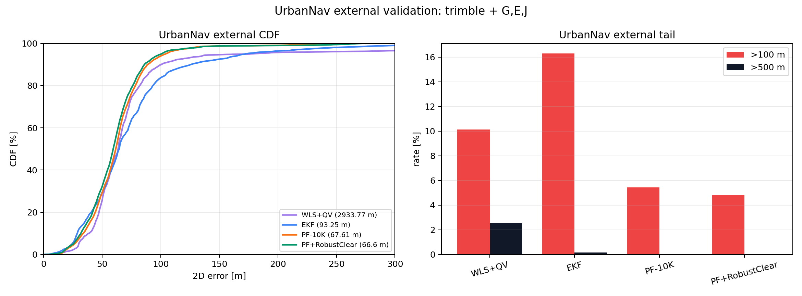
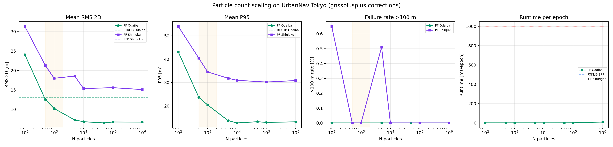
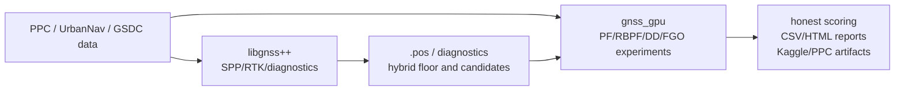

<div align="center">

# gnss_gpu

**GPU-accelerated GNSS positioning for the urban canyon — particle filters, ray-traced NLOS, and factor-graph experiments in real cities.**

[](LICENSE)
[](https://github.com/rsasaki0109/gnss_gpu/actions/workflows/ci.yml)
[](https://rsasaki0109.github.io/gnss_gpu/)
[](https://www.python.org/)


[**Live results snapshot**](https://rsasaki0109.github.io/gnss_gpu/) · [Benchmarks](benchmarks/RESULTS.md) · [Examples](examples/) · [How it's built](internal_docs/plan.md)

</div>

---

## What is this?

`gnss_gpu` is a research workspace for pushing **smartphone- and survey-grade GNSS
positioning in dense cities**, where buildings block and reflect satellite signals and
classic EKF/RTK pipelines fall apart. It pairs CUDA/C++ kernels with Python tooling to
run **GPU particle filters, double-difference carrier tracking, ray-traced line-of-sight
checks against 3D city meshes, and factor-graph optimization** — then scores them
honestly against RTKLIB and EKF baselines on real public datasets (UrbanNav, PLATEAU,
and the GSDC2023 Kaggle smartphone-decimeter challenge).

## Why you might care

- 🛰️ **It beats the classic baseline where it hurts most.** On UrbanNav Tokyo *Odaiba*,
  the `PF 100K (DD + smoother + stop-detect)` filter reaches **1.36 m P50 / 4.11 m RMS**
  versus **RTKLIB demo5 at 2.67 m / 13.08 m** over 12,228 aligned epochs — a **49% better
  median and 69% better RMS**.
- ⚡ **It's genuinely fast.** A full **1,000,000-particle** filter step
  (predict → weight → resample → estimate) runs in **81 ms** (≈12 Hz) on a consumer Ada
  GPU; a 10,000-epoch batch WLS solve takes **~1 ms**. See [`benchmarks/RESULTS.md`](benchmarks/RESULTS.md).
- 🏙️ **City-aware NLOS handling.** Ray tracing against PLATEAU 3D building meshes does
  line-of-sight / non-line-of-sight classification with a **57.8× BVH speedup**, so urban
  multipath can be rejected instead of trusted.
- 📈 **Honest, reproducible scoring.** Every headline number comes from a fixed
  same-input/same-metric comparison, and the [live snapshot](https://rsasaki0109.github.io/gnss_gpu/)
  is regenerated straight from the committed result CSVs.

## Results at a glance

| Method | Dataset | P50 | RMS 2D |
|---|---|--:|--:|
| **PF 100K (DD + smoother + stop-detect)** | UrbanNav Tokyo Odaiba | **1.36 m** | **4.11 m** |
| RTKLIB demo5 | UrbanNav Tokyo Odaiba | 2.67 m | 13.08 m |
| **PF + RobustClear-10K** (external mainline) | UrbanNav, 5 seq / 2 cities | — | **66.6 m** |
| EKF baseline | UrbanNav, 5 seq / 2 cities | — | 93.25 m |

<div align="center">


</div>

> The external-validation RMS is high in absolute terms because it averages the hardest
> deep-urban sequences (including failure stretches). The point is the *relative* gap: the
> GPU PF stack consistently wins against EKF and RTKLIB on the same epochs. Full tables,
> figures, and limitations live on the [results snapshot](https://rsasaki0109.github.io/gnss_gpu/).

## Quick start

```bash
git clone --recurse-submodules https://github.com/rsasaki0109/gnss_gpu.git
cd gnss_gpu

python3 -m venv .venv && source .venv/bin/activate
python3 -m pip install --upgrade pip
python3 -m pip install -r requirements.txt
python3 -m pip install pytest pandas scipy requests matplotlib plotly
```

### Run the demo (no GPU, no data, ~1 second)

The fastest way to see what this repo is about. It simulates a car driving through
an urban canyon where buildings block some satellites (NLOS multipath), then solves
each epoch with plain least squares vs. the package's robust SPP solver:

```bash
PYTHONPATH=python python3 examples/demo_urban_canyon_sim.py
```

```text
method                         P50 err     RMS err
--------------------------------------------------
naive WLS (L2)                 10.30 m     10.21 m
robust SPP (Cauchy)             2.00 m      2.39 m
--------------------------------------------------
robust vs naive: 81% better P50, 77% better RMS
```

Robust down-weighting of NLOS-biased measurements is the same idea the GPU
particle-filter stack scales up to beat RTKLIB demo5 on real UrbanNav data.

### Run the test suite

The pure-Python helpers and experiment logic run without a GPU; tests that exercise
the native CUDA kernels are skipped or fail until you build them (see below):

```bash
PYTHONPATH=python python3 -m pytest tests/ -q
```

Browse [`examples/`](examples/) for runnable demos (acquisition, full pipeline,
interference, urban PLATEAU, real-data replay, visualization). The GPU-accelerated demos
import native modules, so build the kernels first.

### Building the CUDA/C++ kernels

The native kernels back the signal-sim, particle-filter, ray-tracing, and multi-GNSS
solver paths:

```bash
mkdir -p build && cd build
cmake .. -DCMAKE_CUDA_ARCHITECTURES=native
make -j"$(nproc)"
# then copy the generated .so files into python/gnss_gpu/
```

Once built, try a demo, e.g. signal simulation → acquisition round-trip:

```bash
PYTHONPATH=python python3 examples/demo_signal_sim.py
```

## Repository layout

```text
python/gnss_gpu/              Reusable Python package code
src/                          CUDA/C++ kernels and native bindings
examples/                     Runnable demos (start here)
benchmarks/                   GPU throughput benchmarks (+ RESULTS.md)
experiments/                  Experiment runners, sweeps, reports, one-off probes
experiments/results/          Generated CSV/HTML/plot outputs
docs/                         Generated visual snapshot site (the live demo)
internal_docs/                Working notes, decisions, handoffs, current state
third_party/gnssplusplus/     C++ GNSS/RTK/PPP/CLAS solver subproject
tests/                        Python tests for stable helpers and experiment logic
```



## Where to look next

| Goal | First place to look |
|---|---|
| See the live, regenerated results | [Results snapshot site](https://rsasaki0109.github.io/gnss_gpu/) |
| Run a demo | [`examples/`](examples/) |
| Check GPU throughput | [`benchmarks/RESULTS.md`](benchmarks/RESULTS.md) |
| Continue current GSDC2023 Kaggle work | [`internal_docs/plan.md`](internal_docs/plan.md) |
| Understand current PPC production state | [`internal_docs/ppc_current_status.md`](internal_docs/ppc_current_status.md) |
| Find durable decisions and negative results | [`internal_docs/decisions.md`](internal_docs/decisions.md) |
| Work on reusable Python code | [`python/gnss_gpu/`](python/gnss_gpu/) |
| Work on native CUDA/C++ code | [`src/`](src/) |
| Work on the C++ GNSS solver baseline | [`third_party/gnssplusplus/README.md`](third_party/gnssplusplus/README.md) |

## A note on scope

This is **not** a single polished application — it is intentionally experiment-first.
Stable code lives in the library/native directories (`python/gnss_gpu/`, `src/`), while
fast-moving runs, sweeps, generated reports, and Kaggle/PPC handoffs live in
`experiments/` and `internal_docs/`. Many CSV/HTML files are generated or local-only;
before trusting one, check that it is listed in
[`experiments/results/README.md`](experiments/results/README.md) and that its build
command is recorded in [`internal_docs/plan.md`](internal_docs/plan.md).

## Development policy

- Keep stable reusable code in `python/gnss_gpu/` or `src/`; keep variant-heavy logic in
  `experiments/` until it survives fixed evaluation.
- Do not promote a method because it wins one pilot split. Prefer same-input,
  same-metric comparisons over new abstractions.
- Record durable decisions in [`internal_docs/decisions.md`](internal_docs/decisions.md).
- Do not vendor, link, or derive production code/config from GPL-3.0 reference sources
  such as `gici-open`.

## License

[Apache-2.0](LICENSE)
