<div align="center">

# gnss_gpu

**GPU-accelerated GNSS positioning for the urban canyon — particle filters, ray-traced NLOS, and factor-graph experiments in real cities.**

[](LICENSE)
[](https://github.com/rsasaki0109/gnss_gpu/actions/workflows/ci.yml)
[](https://rsasaki0109.github.io/gnss_gpu/)
[](https://rsasaki0109.github.io/gnss_gpu/v0.3.0.html)
[](https://www.python.org/)
[](https://colab.research.google.com/github/rsasaki0109/gnss_gpu/blob/main/examples/colab_urban_canyon_quickstart.ipynb)

<p align="center">
  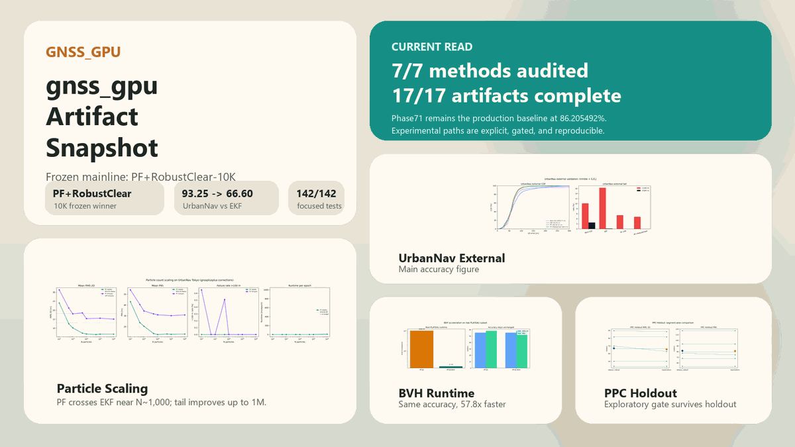
</p>

[**v0.3 release audit**](https://rsasaki0109.github.io/gnss_gpu/v0.3.0.html) · [Live results snapshot](https://rsasaki0109.github.io/gnss_gpu/) · [Technical report](docs/technical_report_v0.3.0.md) · [Benchmarks](benchmarks/RESULTS.md) · [Examples](examples/) · [Input shapes](docs/common_input_shapes.md) · [GSDC2023 solution](docs/gsdc2023_solution.md) · [Experiment log](docs/experiments.md) · [Decisions](docs/decisions.md) · [How it's built](internal_docs/plan.md)

</div>

---

## What is this?

`gnss_gpu` is a research workspace for pushing **smartphone- and survey-grade GNSS
positioning in dense cities**, where buildings block and reflect satellite signals and
classic EKF/RTK pipelines fall apart. It pairs CUDA/C++ kernels with Python tooling to
run **GPU particle filters, double-difference carrier tracking, ray-traced line-of-sight
checks against 3D city meshes, and factor-graph optimization** — then scores them
honestly against RTKLIB and EKF baselines on real public datasets (UrbanNav, PLATEAU,
and the GSDC2023 Kaggle smartphone-decimeter challenge).

The v0.3 reproducibility archive can be rebuilt and verified with one command:

```bash
python tools/build_release_bundle.py --output dist/reproducibility --archive dist/gnss_gpu-v0.3.0-reproducibility.zip
```

## Why you might care

- 🛰️ **It beats the classic baseline where it hurts most.** On UrbanNav Tokyo *Odaiba*,
  the `PF 100K (DD + smoother + stop-detect)` filter reaches **1.36 m P50 / 4.11 m RMS**
  versus **RTKLIB demo5 at 2.67 m / 13.08 m** over 12,228 aligned epochs — a **49% better
  median and 69% better RMS**.
- ⚡ **It's genuinely fast.** A full **1,000,000-particle** filter step
  (predict → weight → resample → estimate) runs in **81 ms** (≈12 Hz) on a consumer Ada
  GPU; a 10,000-epoch batch WLS solve takes **~1 ms**. See [`benchmarks/RESULTS.md`](benchmarks/RESULTS.md).
- 🏙️ **City-aware NLOS handling.** Ray tracing against PLATEAU 3D building meshes does
  line-of-sight / non-line-of-sight classification with a **57.8× BVH speedup**, so urban
  multipath can be rejected instead of trusted.
- 📈 **Honest, reproducible scoring.** Every headline number comes from a fixed
  same-input/same-metric comparison, and the [live snapshot](https://rsasaki0109.github.io/gnss_gpu/)
  is regenerated straight from the committed result CSVs.

## RB-FGO-PF: integer ambiguity without premature collapse

The milestone-2 estimator treats integer ambiguities as persistent discrete
**basins** and Rao-Blackwellizes the continuous fixed-lag GNSS/IMU graph. On the
shared Tokyo PPC benchmark, the shipped WP18 configuration beats the published
inuex35 `<50cm_full%` result on all three runs using the stricter matched-3D
score (missing rover epochs count as failures).

| `<50cm_full%` | Tokyo run1 | Tokyo run2 | Tokyo run3 |
|---|---:|---:|---:|
| inuex35 README | 56.7% | 69.9% | 67.9% |
| libgnss++ GTSAM | 56.8% | **80.5%** | 72.8% |
| **RB-FGO-PF (ours, 3D)** | **59.6%** | 78.7% | **78.1%** |

<p align="center">
  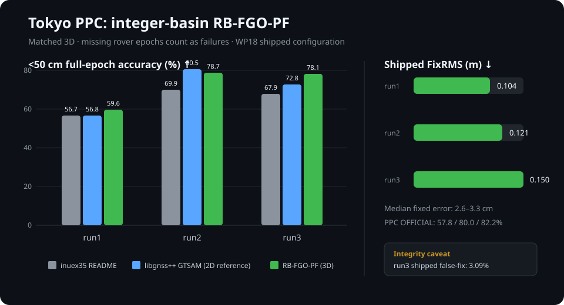
</p>

| Shipped RB-FGO-PF quality | run1 | run2 | run3 |
|---|---:|---:|---:|
| FixRMS ↓ | **0.104 m** | **0.121 m** | **0.150 m** |
| Fix rate | 43.1% | 75.1% | 73.7% |
| Median fixed error | 3.3 cm | 2.6 cm | 3.2 cm |
| False fixes / shipped fixes ↓ | 0.59% | 0.37% | 3.09% |
| PPC OFFICIAL | 57.80% | 80.02% | 82.19% |

The result is deliberately reported with its limits: run3's 3.09% false-fix
rate is above the approximately 2% integrity target, and run1 AllRMS is dominated
by a tunnel float tail. A later basin-memory ablation improves full-run run3 to
83.32% `<50cm_full%` and 0.67% false fixes, but regresses run2 purity; it is
preserved as a negative result and is **not** the shipped configuration. See the
[benchmark record](internal_docs/inuex35_tc_fgo_benchmark.md),
[RB-FGO-PF design](internal_docs/rbpf_fgo_design.md), and
[WP15 CUDA batch-LAMBDA report](results/wp15/WP15_REPORT.md).

## Particle-filter localization on OpenStreetMap

The README headline is not just a table: the sampled particle cloud is localized
on the real street network, with the posterior contracting around the driven
UrbanNav route while the full-view trail is drawn from the continuous trajectory.

### Results at a glance

| Method | Dataset | P50 | RMS 2D |
|---|---|--:|--:|
| **PF 100K (DD + smoother + stop-detect)** | UrbanNav Tokyo Odaiba | **1.36 m** | **4.11 m** |
| RTKLIB demo5 | UrbanNav Tokyo Odaiba | 2.67 m | 13.08 m |
| **PF + RobustClear-10K** (external mainline) | UrbanNav, 5 seq / 2 cities | — | **66.6 m** |
| EKF baseline | UrbanNav, 5 seq / 2 cities | — | 93.25 m |

### PF-only RTK stretch campaign

The current development campaign keeps the full epoch denominator, uses no
reference truth or runtime FGO, and requires declared false FIX at or below 1%.
Latest `libgnss++` selected results are shown only as an external reference;
every imported RTK idea must still pass the PF posterior and promotion gates.

| Full-epoch matched 3D | PF-only locked current | latest libgnss++ reference | v0.3 promotion floor |
|---|---:|---:|---:|
| Tokyo run1 | **46.51%** (5,546 / 11,924) | 80.02% | 45.00% |
| Nagoya run1 | **75.37%** (5,715 / 7,583) | 85.84% | 69.55% non-degradation |

The full WP172 dual-RTK candidate supply is measured at a conservative
42.653 ms/epoch when executed sequentially (21.826 ms/epoch concurrently),
under the 100 ms production budget. WP173 then declares FIX only after a
standard MLAMBDA ratio of at least 3.0 survives five contiguous epochs with at
least six satellites and the complete WP172 consensus gate. Tokyo declares
1,296/11,924 FIX epochs (10.87%) and Nagoya declares 1,370/7,583 (18.07%),
with zero audited false FIX in both runs.

<p align="center">
  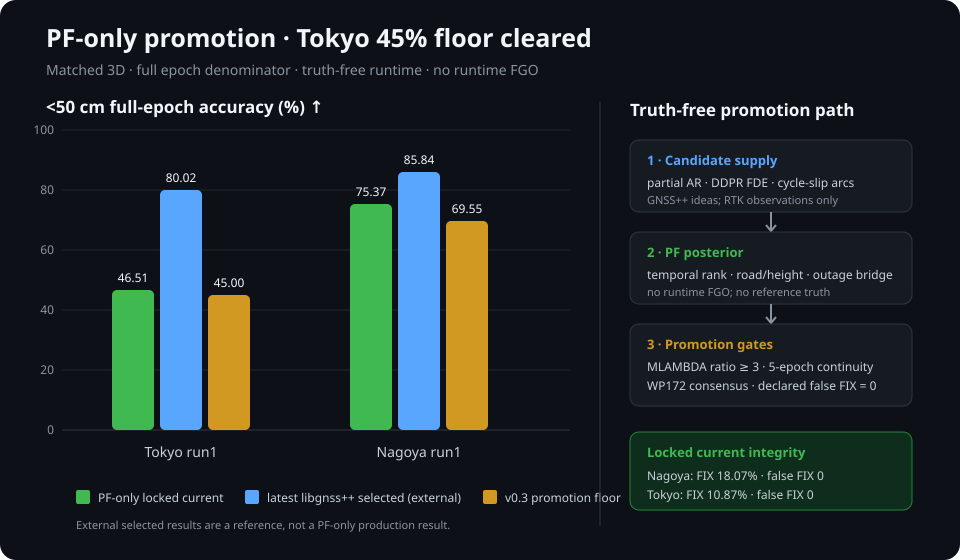
</p>

<div align="center">
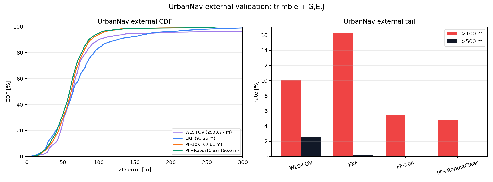
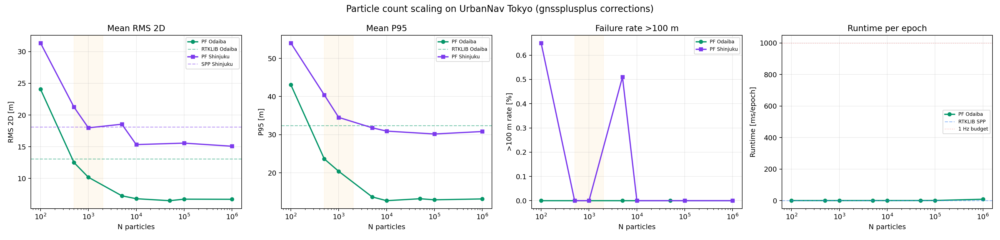
</div>

> The external-validation RMS is high in absolute terms because it averages the hardest
> deep-urban sequences (including failure stretches). The point is the *relative* gap: the
> GPU PF stack consistently wins against EKF and RTKLIB on the same epochs. Full tables,
> figures, and limitations live on the [results snapshot](https://rsasaki0109.github.io/gnss_gpu/).

<p align="center">
  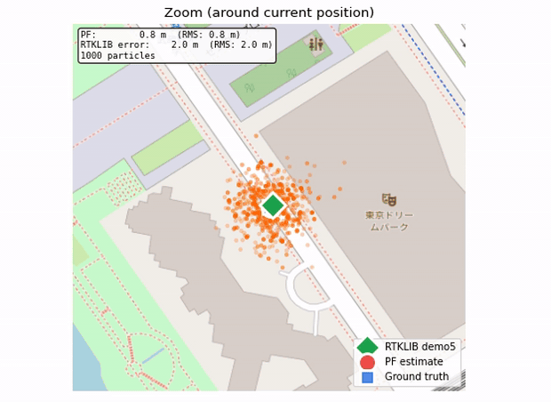
</p>

<p align="center">
  <a href="docs/assets/media/particles/particle_viz_odaiba.mp4">Open the Odaiba particle-cloud video</a>
</p>

For the zero-data terminal demo behind this visual:

```bash
PYTHONPATH=python:. python3 examples/demo_pf_localization_improvement.py
```

It reads checked-in artifacts and prints the UrbanNav Odaiba PF-vs-RTKLIB
improvement plus the PLATEAU LOS/NLOS mask replay gain for PF.

## Ray-traced NLOS diffraction on real city data

Beyond *rejecting* blocked satellites, the package models **why** an urban pseudorange is
biased — knife-edge (ITU-R P.526) and **UTD** (Kouyoumjian–Pathak) diffraction plus
specular reflection over **PLATEAU** 3D building meshes — and scores the physics against
real **UrbanNav** residuals.

<p align="center">
  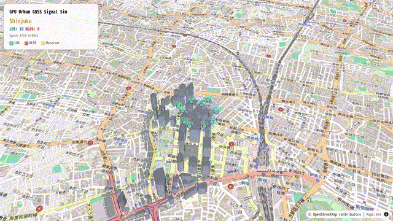
</p>

<p align="center">
  <a href="docs/assets/media/los-nlos/los_nlos_deckgl.html">Open the full LOS/NLOS deck.gl sweep</a>
</p>

A subtle but decisive step is correcting each satellite to signal-**transmission** time
(with the Sagnac rotation). Without it a per-satellite *tens-of-metres* range error swamps
the multipath signal; with it the residual becomes a clean NLOS ground truth (LOS median
**1.0 m**, AUC **0.92**). On that clean reference, **UTD reproduces the measured
multipath-bias distribution better than knife-edge** — reproducing the literature
(Zhang & Hsu, 2021) on properly corrected real data.

<div align="center">
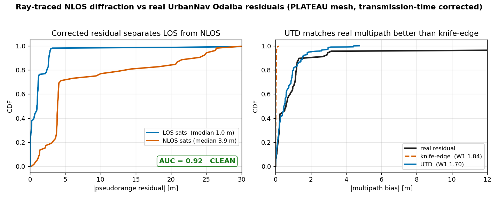
</div>

| Diffraction model | Wasserstein-1 ↓ | KS ↓ |
|---|--:|--:|
| knife-edge (ITU-R P.526) | 1.84 | 0.46 |
| **UTD (Kouyoumjian–Pathak)** | **1.70** | **0.29** |

> UrbanNav Tokyo *Odaiba*, 60 epochs over a 249k-triangle PLATEAU mesh. Reproduce with
> `PYTHONPATH=examples python examples/plot_nlos_diffraction_figure.py Odaiba 60`
> (uses the installed package's CUDA ray-tracing for line-of-sight checks).

## Simulate GNSS anywhere in a city — and predict how well it will work

The same city-aware physics also runs *forward*: given a place (or a route), a time
window, the constellations, and a PLATEAU mesh, the **scenario engine**
(`gnss_gpu.scenario`) simulates the observables a receiver would see there — visible
satellites, LOS/NLOS, pseudorange with clock/ionosphere/troposphere/multipath errors,
C/N0 and Doppler — and can export them as **RINEX 3.04 OBS** (`--rinex-out`) to feed
RTKLIB or any receiver-evaluation pipeline. On top of it, **GPU area sweeps**
(`gnss_gpu.coverage_map`) batch the line-of-sight rays for *all grid cells × all
satellites* into single CUDA launches and map predicted GNSS quality — visible/LOS
counts, availability, DOP, expected horizontal error — over a whole district in
seconds.

<div align="center">
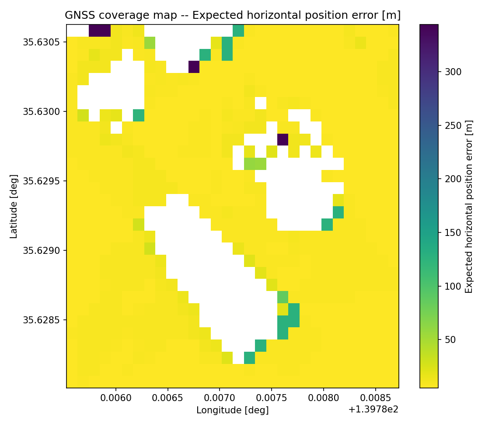
</div>

```bash
PYTHONPATH=python python examples/demo_scenario_engine.py   # observables at a point
PYTHONPATH=python python examples/demo_coverage_map.py      # per-cell quality map (PNG + deck.gl)
```

Three worked use cases on the same real Odaiba data (UrbanNav route + PLATEAU mesh):

| Use case | Demo | What it surfaces |
|---|---|---|
| **Test-course / route evaluation** | `demo_route_accuracy.py` | Availability (≥4 LOS) stays 100%, yet expected HPE spikes past 300 m where the surviving 4-satellite geometry goes near-singular — a quality cliff a satellite-count threshold would miss. |
| **RTK base-station placement** | `demo_rtk_base_placement.py` | Open-sky candidate cells tie on LOS count and HDOP; the **common-view satellite count** against the rover route is what actually ranks them. |
| **Site multipath assessment** | `demo_urban_multipath.py` | Fixed-site sky map of LOS/NLOS tracks with per-satellite multipath excess and C/N0 (UTD diffraction): 28.6% NLOS, 18.9 dB-Hz LOS-vs-NLOS C/N0 gap at a canyon point. |

<div align="center">
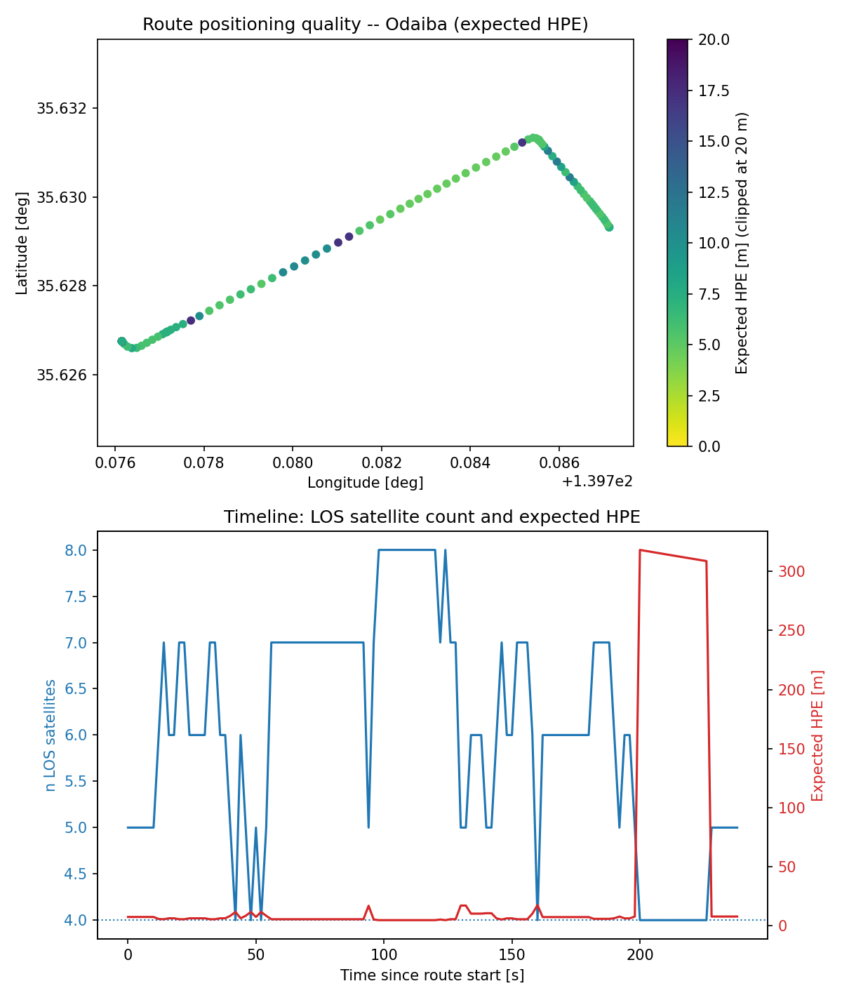
</div>

Unlike closed propagation tools, every model here is scored against real measured
residuals (the UTD-vs-knife-edge benchmark above), and the whole pipeline is open —
from CityGML parsing to the CUDA kernels.

## Quick start

### GPU-first start

The supported first-run path assumes an NVIDIA GPU, a current driver, and a CUDA
Toolkit with `nvcc`. From a fresh checkout:

```bash
git clone --recurse-submodules https://github.com/rsasaki0109/gnss_gpu.git
cd gnss_gpu
python3 -m venv .venv
# Linux/macOS: source .venv/bin/activate
# Windows PowerShell: .venv\Scripts\Activate.ps1
python3 -m pip install --upgrade pip
python3 python/gnss_gpu/cli.py doctor
python3 python/gnss_gpu/cli.py build
gnss-gpu doctor
gnss-gpu run --preset signal-acquisition
```

`doctor` checks the NVIDIA driver, GPU, CUDA compiler, CMake, native bindings,
and a real signal-simulation → acquisition CUDA round-trip. A checkout without
built bindings reports `READY TO BUILD`; a working installation reports
`READY TO RUN`. The demo writes a reproducibility manifest under `runs/`.

On Windows, use `python` in place of `python3` in a Developer PowerShell for Visual Studio.
Use `gnss-gpu doctor --json doctor.json` when attaching environment details to
an issue. Advanced users can target a specific CUDA architecture with
`gnss-gpu build --architecture 89`.

### GPU experiment loop: PLATEAU NLOS

After the signal-acquisition smoke test, run the reproducible PLATEAU CityGML
mask/replay suite. It uses the CUDA BVH ray tracer and reuses the checked-in
SPP, particle-filter, and local-FGO replay consumers:

```bash
gnss-gpu run --preset plateau-nlos
```

The default input is `data/sample_plateau.gml`. Each run writes a timestamped
directory under `runs/` containing the mask, per-estimator summaries, a suite
CSV/JSON/Markdown report, and `manifest.json`. The manifest has the common v1
schema (`schema`, `version`, `git_sha`, `backend`, `gpu`, `input_hashes`,
`parameters`, `metrics`, and hashed `artifacts`) so runs can be compared safely.
The run ends by printing the next suggested command; for an explicit second
configuration use, for example:

```bash
gnss-gpu run --preset plateau-nlos --output-dir runs/plateau-nlos-candidate
gnss-gpu compare runs/20260828T000000Z runs/plateau-nlos-candidate
```

`compare` prints precision/runtime deltas and writes `comparison.md` beside the
candidate run. Use `--json PATH` for machine-readable output. Baseline and
candidate must use compatible run-manifest schemas and the same preset; differing
input hashes or backends are reported as warnings. A missing CityGML file or
CUDA BVH gives a concrete repair hint. `--allow-cpu-fallback` is available only
for a CPU smoke test and is not the GPU benchmark path.

### Browser/CPU reference

**Zero install:** run the urban-canyon demo — with sky plot and trajectory
figures — straight in your browser:
[](https://colab.research.google.com/github/rsasaki0109/gnss_gpu/blob/main/examples/colab_urban_canyon_quickstart.ipynb)

Or locally:

```bash
git clone --recurse-submodules https://github.com/rsasaki0109/gnss_gpu.git
cd gnss_gpu

python3 -m venv .venv && source .venv/bin/activate
python3 -m pip install --upgrade pip
python3 -m pip install -r requirements.txt
python3 -m pip install pytest pandas scipy requests matplotlib plotly
```

### Run the demo (no GPU, no data, ~1 second)

The fastest way to see what this repo is about. It simulates a car driving through
an urban canyon where buildings block some satellites (NLOS multipath), then solves
each epoch with plain least squares vs. the package's robust SPP solver:

```bash
PYTHONPATH=python python3 examples/demo_urban_canyon_sim.py
```

```text
method                         P50 err     RMS err
--------------------------------------------------
naive WLS (L2)                 10.30 m     10.21 m
robust SPP (Cauchy)             2.00 m      2.39 m
--------------------------------------------------
robust vs naive: 81% better P50, 77% better RMS
```

Robust down-weighting of NLOS-biased measurements is the same idea the GPU
particle-filter stack scales up to beat RTKLIB demo5 on real UrbanNav data.

### Use the robust SPP solver from Python

For library code, the same CPU-only solver is available from the package top level:

```python
import numpy as np
from gnss_gpu import robust_spp

sat_ecef = np.asarray(...)       # shape: (n_sat, 3), metres
pseudoranges = np.asarray(...)   # shape: (n_sat,), metres
weights = np.ones(len(pseudoranges))
coarse_ecef = np.asarray(...)    # shape: (3,), metres

position_ecef = robust_spp(
    sat_ecef,
    pseudoranges,
    weights=weights,
    init_pos=coarse_ecef,
    weight_func="cauchy",
    threshold=15.0,
)
if position_ecef is None:
    raise RuntimeError("SPP failed; check satellite count and geometry")
```

Bad input shapes, non-finite values, negative weights, and invalid solver options
raise `ValueError` with messages that name the offending argument.

For a measurement-level NLOS simulator with explicit ray-cast building blockage,
C/N0 attenuation, excess delay, and a geometry-aware SPP comparison:

```bash
PYTHONPATH=python python3 examples/demo_nlos_simulation.py
PYTHONPATH=python python3 examples/demo_plateau_nlos_simulation.py
PYTHONPATH=python python3 examples/demo_plateau_nlos_visualization.py
PYTHONPATH=python:. python3 experiments/run_plateau_nlos_demo_suite.py
```

The suite command exports the mask, replays SPP/PF/FGO, and writes combined
JSON/Markdown/CSV summaries. The individual replay commands are:

| Replay consumer | Baseline RMS | Mask-soft RMS | RMS gain |
|---|---:|---:|---:|
| SPP | 11.85 m | 4.07 m | 65.6% |
| PF | 11.18 m | 1.40 m | 87.4% |
| local-FGO | 8.10 m | 0.38 m | 95.4% |

```bash
PYTHONPATH=python:. python3 experiments/export_plateau_nlos_demo_mask.py \
  --out-csv experiments/results/plateau_nlos_demo_mask.csv \
  --summary-json experiments/results/plateau_nlos_demo_mask_summary.json
PYTHONPATH=python:. python3 experiments/replay_plateau_nlos_demo_spp.py \
  --mask-csv experiments/results/plateau_nlos_demo_mask.csv \
  --summary-json experiments/results/plateau_nlos_demo_spp_replay_summary.json
PYTHONPATH=python:. python3 experiments/replay_plateau_nlos_demo_pf.py \
  --mask-csv experiments/results/plateau_nlos_demo_mask.csv \
  --summary-json experiments/results/plateau_nlos_demo_pf_replay_summary.json
PYTHONPATH=python:. python3 experiments/replay_plateau_nlos_demo_fgo.py \
  --mask-csv experiments/results/plateau_nlos_demo_mask.csv \
  --summary-json experiments/results/plateau_nlos_demo_fgo_replay_summary.json
```

The PLATEAU visualization is also checked into the Pages assets at
[`docs/assets/media/demos/plateau_nlos_visualization.html`](docs/assets/media/demos/plateau_nlos_visualization.html).
The exported mask CSV uses the existing experiment contract
`tow,epoch_idx,prn,is_los`; the SPP, particle-filter, and local-FGO replays
consume only that mask path and show mask-soft downstream estimators recovering
the simulated NLOS error.

### Smoke test

CPU-only wrapper tests validate input shapes and error messages without a GPU rebuild:

```bash
PYTHONPATH=python pytest tests/test_*_wrapper.py -q
```

### Run the test suite

The pure-Python helpers and experiment logic run without a GPU; tests that exercise
the native CUDA kernels are skipped or fail until you build them (see below):

```bash
PYTHONPATH=python python3 -m pytest tests/ -q
```

Browse [`examples/`](examples/) for runnable demos (acquisition, full pipeline,
interference, urban PLATEAU, real-data replay, visualization). The GPU-accelerated demos
import native modules, so build the kernels first.

The top-level positioning names remain defined on CPU-only installations.
Calling a native-only operation raises
`gnss_gpu.NativeBackendUnavailableError` with the missing module and build
guidance. An installed extension that is broken (for example because a
dependent CUDA DLL is missing) is reported as its original import error rather
than being hidden as a normal CPU-only installation.

### Building the CUDA/C++ kernels

The native kernels back the signal-sim, particle-filter, ray-tracing, and multi-GNSS
solver paths:

The recommended build installs every native module into the active Python
environment; no manual `.so`/`.pyd` copy is needed:

```bash
python3 python/gnss_gpu/cli.py build
gnss-gpu doctor
```

To inspect the generated build command without changing the environment, use
`python3 python/gnss_gpu/cli.py build --dry-run`.

Once built, try a demo, e.g. signal simulation → acquisition round-trip:

```bash
gnss-gpu run --preset signal-acquisition
```

## ROS 2 node

For outdoor robots, [`ros2/gnss_gpu_ros`](ros2/gnss_gpu_ros/) packages the
trajectory-filtering ideas validated on GSDC2023 as a ROS 2 node: it gates
multipath/NLOS spikes in `sensor_msgs/NavSatFix` streams (Hampel + CV Kalman)
before they reach your fusion stack, and publishes an RViz-friendly path.

```bash
ros2 run gnss_gpu_ros robust_navsat_filter --ros-args -r fix:=/your_gnss_driver/fix
```

## Repository layout

```text
python/gnss_gpu/              Reusable Python package code
src/                          CUDA/C++ kernels and native bindings
examples/                     Runnable demos (start here)
benchmarks/                   GPU throughput benchmarks (+ RESULTS.md)
experiments/                  Experiment runners, sweeps, reports, one-off probes
experiments/results/          Generated CSV/HTML/plot outputs
docs/                         Generated visual snapshot site (the live demo)
ros2/gnss_gpu_ros/            ROS 2 robust NavSatFix filter node
internal_docs/                Working notes, decisions, handoffs, current state
third_party/gnssplusplus/     C++ GNSS/RTK/PPP/CLAS solver subproject
tests/                        Python tests for stable helpers and experiment logic
```

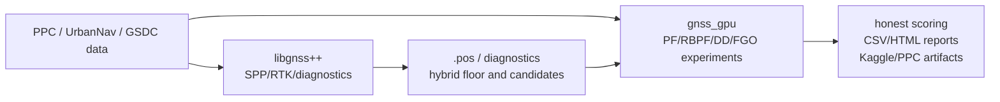
```mermaid
flowchart LR
    Data["PPC / UrbanNav / GSDC data"] --> Lib["libgnss++\nSPP/RTK/diagnostics"]
    Lib --> Floor[".pos / diagnostics\nhybrid floor and candidates"]
    Data --> GPU["gnss_gpu\nPF/RBPF/DD/FGO experiments"]
    Floor --> GPU
    GPU --> Score["honest scoring\nCSV/HTML reports\nKaggle/PPC artifacts"]
```

## Where to look next

| Goal | First place to look |
|---|---|
| See the live, regenerated results | [Results snapshot site](https://rsasaki0109.github.io/gnss_gpu/) |
| Run a demo | [`examples/`](examples/) |
| Check GPU throughput | [`benchmarks/RESULTS.md`](benchmarks/RESULTS.md) |
| Continue current GSDC2023 Kaggle work | [`internal_docs/plan.md`](internal_docs/plan.md) |
| Understand current PPC production state | [`internal_docs/ppc_current_status.md`](internal_docs/ppc_current_status.md) |
| Find durable decisions and negative results | [`internal_docs/decisions.md`](internal_docs/decisions.md) |
| Work on reusable Python code | [`python/gnss_gpu/`](python/gnss_gpu/) |
| Work on native CUDA/C++ code | [`src/`](src/) |
| Work on the C++ GNSS solver baseline | [`third_party/gnssplusplus/README.md`](third_party/gnssplusplus/README.md) |

## A note on scope

This is **not** a single polished application — it is intentionally experiment-first.
Stable code lives in the library/native directories (`python/gnss_gpu/`, `src/`), while
fast-moving runs, sweeps, generated reports, and Kaggle/PPC handoffs live in
`experiments/` and `internal_docs/`. Many CSV/HTML files are generated or local-only;
before trusting one, check that it is listed in
[`experiments/results/README.md`](experiments/results/README.md) and that its build
command is recorded in [`internal_docs/plan.md`](internal_docs/plan.md).

## Development policy

- Keep stable reusable code in `python/gnss_gpu/` or `src/`; keep variant-heavy logic in
  `experiments/` until it survives fixed evaluation.
- Do not promote a method because it wins one pilot split. Prefer same-input,
  same-metric comparisons over new abstractions.
- Record durable decisions in [`internal_docs/decisions.md`](internal_docs/decisions.md).
- Do not vendor, link, or derive production code/config from GPL-3.0 reference sources
  such as `gici-open`.

## License

[Apache-2.0](LICENSE)
