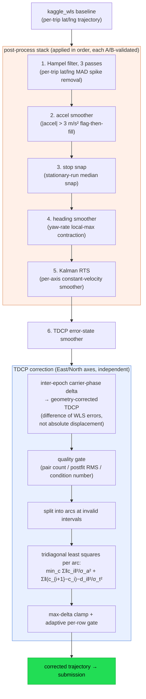

# GSDC2023 solution write-up — a trajectory post-processing stack worth −0.8 m

How this repo's pipeline scores on the
[Google Smartphone Decimeter Challenge 2023](https://www.kaggle.com/competitions/smartphone-decimeter-2023)
(Kaggle, smartphone GNSS, scored as mean of per-trip P50+P95 horizontal error):

| Submission | Kaggle public | Kaggle private |
|---|--:|--:|
| **best (v13: full stack + TDCP, adaptive row-gate)** | **3.224 m** | **3.783 m** |
| v8 (post-process stack, no TDCP) | — | 4.385 m |

On the 41 ground-truthed train trips the same chain moves the mean P50+P95
metric from **4.78 m (raw WLS) to 3.97 m (−0.81 m / −17%)** — with *no factor
graph in the final path*. The interesting part of this solution is **where the
gains actually came from**, and the honest list of things that did not work.

## TL;DR

1. We built a full FGO (factor-graph optimization) bridge with Cauchy robust
   kernels, consistency pre-filters, and max-clique inlier voting. It improved
   FGO standalone accuracy by ~27%… and the selection gate still preferred the
   WLS baseline on ~99% of rows. **The gate was right** — forcing FGO in was a
   regression every time we tried.
2. The wins came from **trajectory-domain post-processing** of the baseline:
   six independent layers, each validated by a 41-trip A/B before stacking.
3. The single largest lever (−0.43 m, bigger than the other five combined) was
   a **TDCP error-state smoother**: carrier-phase time-differences used to
   estimate *corrections between consecutive WLS errors*, not absolute
   displacements — which sidesteps Android clock discontinuities entirely.

## Architecture



## Layer-by-layer: what each centimetre cost

Every layer was added only after a full 41-trip train A/B (mean of per-trip
P50+P95, same epochs, same metric). Deltas are vs. the previous layer:

| # | Layer | Idea | Δ train metric | Win/loss ratio |
|--:|---|---|--:|---|
| 1 | Hampel ×3 passes | per-trip lat/lng MAD outlier peel-away (window 21, k=2.5) | **−7.0 cm** | 41/41 improve or wash; max frame-to-frame jump 18,619 → 485 m (−97%) across the three passes |
| 2 | accel smoother | flag epochs with \|accel\| > 3 m/s², linear-fill; local-max contraction avoids flagging innocent neighbours | **−15.2 cm** | 32 wins / 6 regressions |
| 3 | stop snap | runs of ≥10 epochs moving <2 m get snapped to their median (traffic lights) | **−4.2 cm** | 29 wins / 8 regressions |
| 4 | heading smoother | contract isolated yaw-rate spikes (>45°/s) by interpolation | **−1.6 cm** | 9 wins / 30 wash / 2 regressions |
| 5 | Kalman RTS | per-axis 1D constant-velocity forward filter + Rauch–Tung–Striebel backward smoother | **−9.6 cm** | 39 wins / 1 regression |
| 6 | TDCP error-state smoother | see below | **−43 cm** | largest single lever in the stack |

Cumulative on train: 4.78 m → 3.97 m. On Kaggle private, the TDCP layer alone
was worth **−60 cm** over the v8 stack.

Layers 1–5 are deliberately boring: each is ~150–200 lines of NumPy with unit
tests, exploits one independent physical signal (statistical spikes, dynamics
limits, stationarity, heading continuity, motion smoothness), and composes
additively because the signals don't overlap.

## The TDCP layer — why naive TDCP fails on Android

TDCP (time-differenced carrier phase) gives near-cm-precision *deltas* between
epochs. The textbook approach — solve a 4-parameter least squares
[Δposition, c·Δclock] per epoch pair — failed catastrophically on this data:
**mean delta error 1971 m vs. 15.6 m ground truth** on the prototype trip. The
root cause is Android's `HardwareClockDiscontinuityCount`: the receiver clock
state jumps frequently, and any formulation estimating an absolute
displacement+clock per interval inherits those jumps.

The fix is to change the *state being estimated*:

- Reference every TDCP observation against the **existing WLS trajectory**
  (geometry correction), so each interval's observable becomes the *difference
  of consecutive WLS position errors* — a correction increment. The clock
  nuisance largely cancels within the interval.
- Per-interval Huber IRLS solve → quality gate on pair count, postfit RMS, and
  condition number → arcs split at gate failures.
- Each arc is then smoothed globally as a **tridiagonal error-state least
  squares** problem per axis (East/North): anchor term keeps corrections small,
  difference term makes consecutive corrections follow the TDCP increments.
- A max-delta clamp and an adaptive per-row displacement gate (conservative on
  device families that regressed in A/B, aggressive elsewhere) protect the
  Kaggle metric's P95 tail.

## What did NOT work (so you don't have to)

Negative results, all from same-input/same-metric A/Bs:

| Attempt | Outcome |
|---|---|
| Naive 4-param TDCP LS | 1971 m mean delta error — Android clock discontinuities (see above) |
| Cauchy-robust FGO forced past the selection gate | FGO worse than baseline on 4/4 audit trips; every gate-relaxation sweep was neutral or +1.4 m worse. The conservative gate was correct. |
| Constant-acceleration Kalman / iterative smoother passes | CA tied with CV at best; 2nd/3rd CV passes +0.7/+2.9 cm monotonic over-smoothing regression. One CV pass is the optimum. |
| Hatch (carrier) smoothing of pseudoranges | aggregate wash — urban arcs too short (mean 14 epochs) and iono divergence between corrected code and raw carrier |
| Saastamoinen troposphere swap | wash (+0.2%) — Android's `TroposphericDelayMeters` is already Saastamoinen-class |
| Double-difference carrier broad-apply | Kaggle +5.5 cm regression; 84% of changed rows landed in regressing trips |
| Smaller FGO chunks (200 → 100 epochs) | root cause of a full-blown submission regression: 7% of rows flipped source, r = 0.83 correlation with >5 m errors |

The pattern: **measurement-domain corrections (iono/tropo/smoothing) were
structurally exhausted** — the WLS baseline is already good and the gate keeps
it — while **trajectory-domain post-processing kept paying** because it attacks
errors the per-epoch solver cannot see (temporal coherence, dynamics,
stationarity, carrier-phase deltas).

## Reproduce

All code is in [`experiments/`](../experiments), pure Python on top of the
shipped solvers, each layer with unit tests:

```bash
# layers 1–5 (each script: per-trip A/B + apply, ~150–200 lines)
experiments/postprocess_gsdc2023_submission_hampel.py
experiments/postprocess_gsdc2023_submission_accel_smooth.py
experiments/postprocess_gsdc2023_submission_stop_snap.py
experiments/postprocess_gsdc2023_submission_heading.py
experiments/postprocess_gsdc2023_submission_kalman.py

# layer 6: TDCP error-state smoother
experiments/eval_gsdc2023_tdcp_correction_smoother.py     # train eval / parameter sweep
experiments/apply_gsdc2023_tdcp_to_submission.py          # production apply (test set)
experiments/merge_gsdc2023_tdcp_adaptive_submission.py    # adaptive per-row gate merge

# the FGO bridge that the gate (correctly) kept rejecting
experiments/build_gsdc2023_bridge_submission.py           # --fgo-robust-kernel cauchy etc.
experiments/gsdc2023_fgo_cauchy_irls.py
experiments/gsdc2023_pairwise_consistency.py
```

The post-process stack is wired into the submission builder
(`--kalman-smoother --kalman-smoother-sigma-a 1.0 --kalman-smoother-sigma-z 1.0`
etc.) and is bit-exact reproducible from the committed configs.

## See also

- [README](../README.md) — project overview and UrbanNav results
- [Experiment log](experiments.md) and [decisions](decisions.md)
- [Live results snapshot](https://rsasaki0109.github.io/gnss_gpu/)
