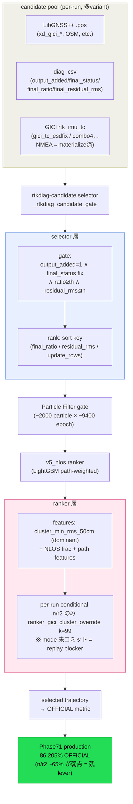

# アルゴリズム構成図

主要 2 パイプラインのデータフロー図。コード実体は
`experiments/eval_gsdc2023_tdcp_correction_smoother.py` と
`experiments/exp_ppc_ctrbpf_fgo.py`（selector / PF / ranker 層）。

## 1. GSDC2023 — TDCP error-state correction smoother + v8 chain

`kaggle_wls` baseline trajectory に v8 post-process stack を適用し、その後段で
TDCP error-state smoother を E/N 各軸独立の tridiagonal LS として解く。clock
discontinuity を避けるため、絶対変位ではなく WLS-error 差分（inter-epoch）で
TDCP を couple するのが要点。

```mermaid
flowchart TD
    A["kaggle_wls baseline<br/>(per-trip lat/lng trajectory)"] --> B["v8 post-process chain<br/>_apply_v8_chain"]

    subgraph V8["v8 outlier+motion stack (順次適用)"]
        direction TB
        B1["1. Cauchy + pairwise<br/>(robust WLS pre-filter)"]
        B2["2. Hampel iter=3<br/>(per-trip lat/lng MAD spike除去)"]
        B3["3. accel-smoother<br/>(|accel|>3m/s² flag-then-fill)"]
        B4["4. stop-snap<br/>(stationary run median snap)"]
        B5["5. heading-smoother<br/>(yaw-rate local-max contract)"]
        B6["6. Kalman RTS<br/>(per-axis CV motion smoother)"]
        B1 --> B2 --> B3 --> B4 --> B5 --> B6
    end
    B --> V8

    B6 --> C["TDCP error-state smoother<br/>_apply_tdcp_smoother"]

    subgraph TDCP["TDCP correction (E/N 各軸独立)"]
        direction TB
        T1["inter-epoch carrier-phase delta<br/>→ geometry-corrected TDCP<br/>(WLS-error差分, 絶対変位ではない)"]
        T2["quality gate<br/>pair count / postfit RMS / cond number"]
        T3["valid間隔で chain split<br/>(無効区間でarc分割)"]
        T4["tridiagonal LS<br/>_solve_correction_axis"]
        T5["min_c Σ‖c_i‖²/σ_anchor²<br/>+ Σ‖(c_{i+1}−c_i)−d_i‖²/σ_tdcp²"]
        T6["max-delta clamp"]
        T1 --> T2 --> T3 --> T4 --> T5 --> T6
    end
    C --> TDCP

    T6 --> D["correction を ENU で適用<br/>_ecef_to_enu_delta"]
    D --> E["ENU → LLA 逆変換<br/>_ecef_to_lla"]
    E --> F["corrected trajectory<br/>(v15-fine submission)"]

    style F fill:#2d5,stroke:#1a3,color:#000
    style TDCP fill:#e8f0ff,stroke:#5588dd
    style V8 fill:#fff0e8,stroke:#dd8855
```

## 2. PPC2024 — selector → PF → ranker パイプライン

candidate pool（per-run の LibGNSS++ `.pos` + 診断 `.csv`、GICI `rtk_imu_tc` を
含む多 variant）を 3 層で絞り込む。gici_tc は selector pool に投入済。90% 突破の
残 lever は最下流の n/r2 ranker 層だが、`ranker_gici_cluster_override` mode が
未コミットで production replay 不可という blocker 付き。

