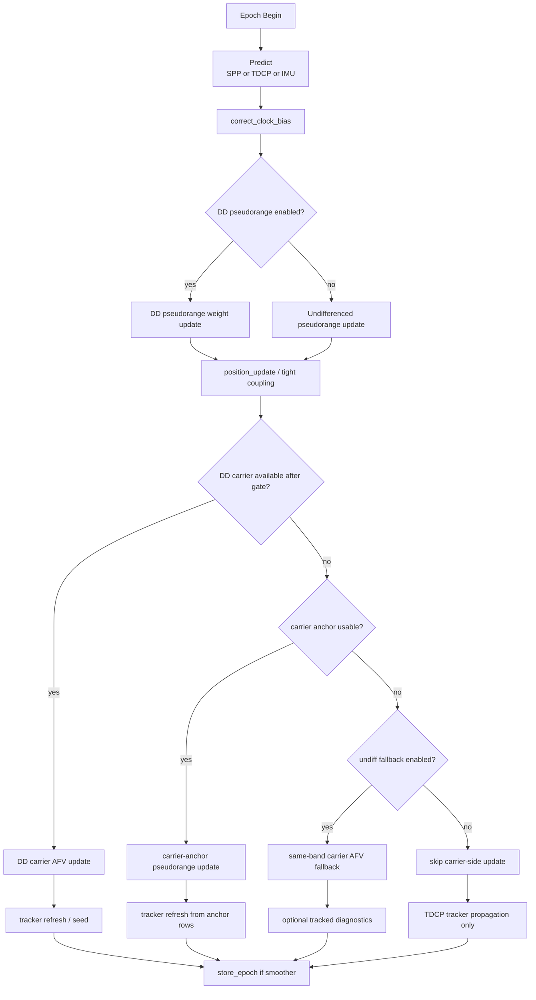
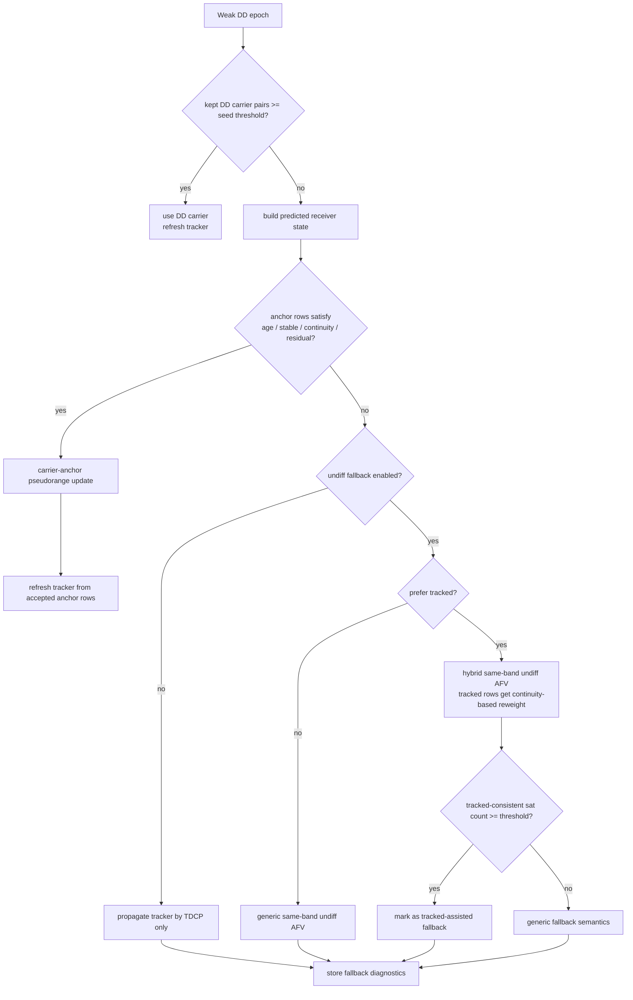
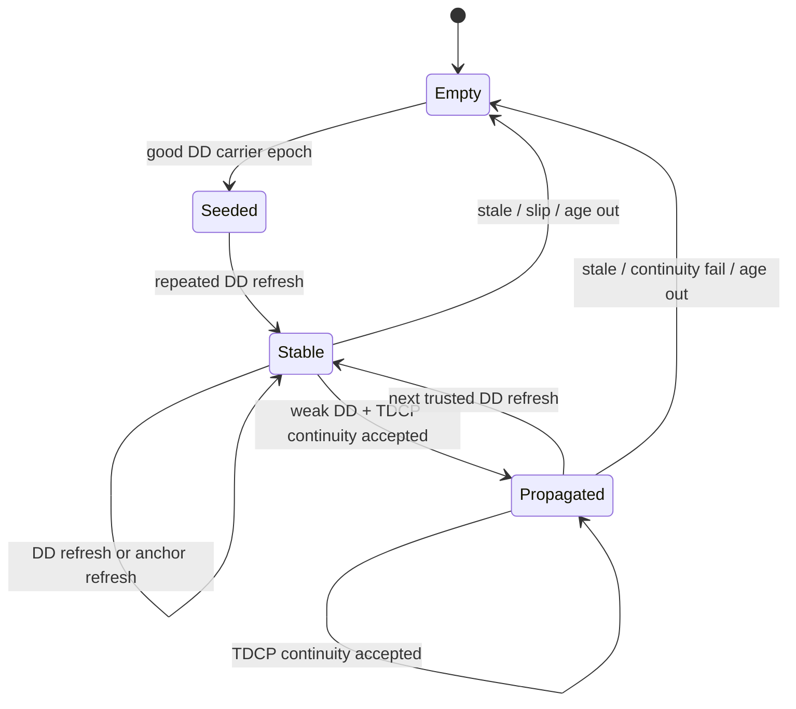
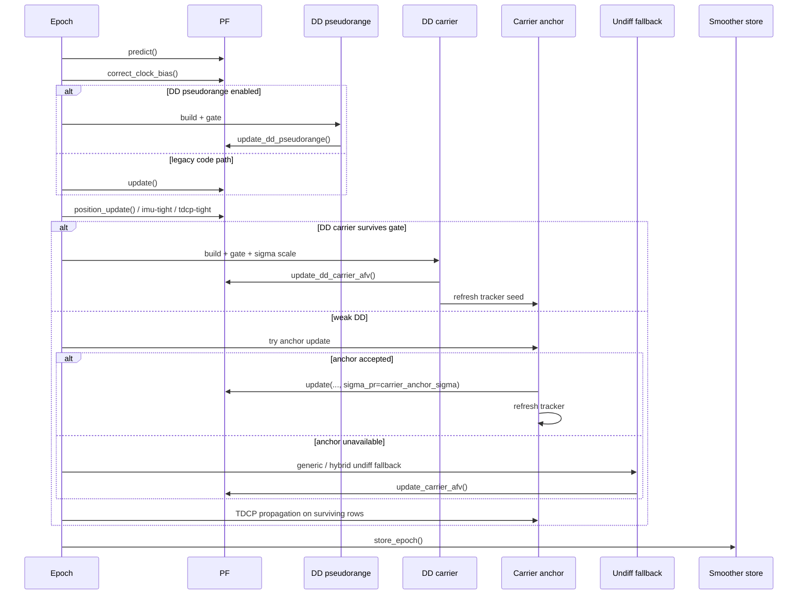

# PF Smoother API

## 目的

`experiments/exp_pf_smoother_eval.py` は単なる評価スクリプトではなく、この repo の
`DD pseudorange` / `DD carrier AFV` / `carrier anchor` / `undiff fallback` を統合する
実験ハブになっている。

ここでは「開発者が壊さず拡張するための最小 API」と「epoch 内の状態遷移」をまとめる。

対象ファイル:
- [exp_pf_smoother_eval.py](/workspace/ai_coding_ws/gnss_gpu/experiments/exp_pf_smoother_eval.py)
- [run_pf_smoother_odaiba_reference.sh](/workspace/ai_coding_ws/gnss_gpu/experiments/run_pf_smoother_odaiba_reference.sh)
- [particle_filter_device.py](/workspace/ai_coding_ws/gnss_gpu/python/gnss_gpu/particle_filter_device.py)
- [dd_quality.py](/workspace/ai_coding_ws/gnss_gpu/python/gnss_gpu/dd_quality.py)

## 再現入口

refactor や CUDA binding 変更後に Odaiba の rescue stack を同条件で見直すときは、
[run_pf_smoother_odaiba_reference.sh](/workspace/ai_coding_ws/gnss_gpu/experiments/run_pf_smoother_odaiba_reference.sh)
を使う。

使い方:
- `URBANNAV_DATA_ROOT=/tmp/UrbanNav-Tokyo bash experiments/run_pf_smoother_odaiba_reference.sh`
- `python3 experiments/exp_pf_smoother_eval.py --data-root /tmp/UrbanNav-Tokyo --preset odaiba_reference`
- smoke は `bash experiments/run_pf_smoother_odaiba_reference.sh --max-epochs 10`

約束:
- script 内の flag 列は「frozen reference」であり、headline best を更新したいときだけ変える
- 追加引数は末尾に足すので、`--max-epochs`, `--epoch-diagnostics-out`, `--carrier-anchor-max-residual-m` などを上書きできる

現在の Odaiba preset の DD carrier adaptive floor:

| preset | `--mupf-dd-gate-adaptive-floor-cycles` | 理由 |
|---|---:|---|
| `odaiba_reference` | `0.18` | IMU stop-detect ありの smoother-first reference。SMTH P50 が最良で RMS は `0.25` と同等 |
| `odaiba_reference_guarded` | `0.18` | guarded smoother でも RMS が少し改善。stop-detect guarded ablation は未昇格 |
| `odaiba_stop_detect` | `0.25` | IMU stop-detect ありの forward-stable sibling。SMTH RMS は同等で FWD P50/RMS が明確に良い |

## エントリポイント

### 1. dataset loader

場所:
- [exp_pf_smoother_eval.py](/workspace/ai_coding_ws/gnss_gpu/experiments/exp_pf_smoother_eval.py#L828)

契約:
- `load_pf_smoother_dataset(run_dir, rover_source="trimble") -> dict[str, object]`
- `run_dir` は UrbanNav run directory
- 返り値は `epochs`, `spp_lookup`, `gt`, `our_times`, `first_pos`, `init_cb` を最低限含む
- `predict_guide` が IMU 系なら `imu_data` を含んでよい

この loader は experiment 間で再利用する。
`exp_submeter_sweep.py`, `exp_ffbsi_eval.py`, `exp_zenbu_sweep.py` も同じ dataset 契約に乗る。

### 2. main runtime API

場所:
- [exp_pf_smoother_eval.py](/workspace/ai_coding_ws/gnss_gpu/experiments/exp_pf_smoother_eval.py#L923)

契約:
- `run_pf_with_optional_smoother(...) -> dict[str, object]`

主要な引数グループ:

| group | 代表引数 | 役割 | 備考 |
|---|---|---|---|
| `predict` | `predict_guide`, `sigma_pos`, `sigma_pos_tdcp` | epoch 先頭の motion prior | `spp`, `tdcp`, `imu` 系を切り替える |
| `pseudorange` | `sigma_pr`, `position_update_sigma` | code 系の基本 weight / soft constraint | `position_update_sigma < 0` で無効化 |
| `dd_pseudorange` | `dd_pseudorange*` | primary weight update | `DD pseudorange` gate と scale を全部含む |
| `dd_carrier` | `mupf_dd*` | secondary AFV update | gate, adaptive sigma, support-skip を含む |
| `carrier_anchor` | `carrier_anchor*` | weak-DD epoch の pseudorange-like rescue | tracker seed / refresh / propagation と組で使う |
| `undiff_fallback` | `mupf_dd_fallback_*` | DD carrier が薄い epoch の保険 | generic, tracked, hybrid の全部がここに入る |
| `diagnostics` | `collect_epoch_diagnostics`, `smoother_tail_guard_*` | per-epoch dump と tail analysis | experiment-local。runtime fast pathでは必須ではない |

主要な返り値:

| key | 型 | 意味 |
|---|---|---|
| `forward_metrics` | `dict \| None` | forward pass の集計結果 |
| `smoothed_metrics` | `dict \| None` | smoother 有効時の集計結果 |
| `elapsed_ms` | `float` | run 全体の wall-clock |
| `epoch_diagnostics` | `list[dict]` | aligned epoch ごとの dump |
| `n_dd_fallback_undiff_used` | `int` | undiff fallback が実際に update された epoch 数 |
| `n_dd_fallback_tracked_attempted` | `int` | tracked/hybrid fallback を試した epoch 数 |
| `n_dd_fallback_tracked_used` | `int` | tracked-assisted fallback と判定された epoch 数 |
| `n_carrier_anchor_used` | `int` | carrier-anchor update を打った epoch 数 |
| `n_carrier_anchor_propagated` | `int` | tracker を TDCP continuity だけで前進させた row 数 |

返り値 dict は experiment-local であり、library-stable API ではない。
ただし sweep script が依存しているカウンタは削らない方がよい。

## 主要 state

### CarrierBiasState

場所:
- [exp_pf_smoother_eval.py](/workspace/ai_coding_ws/gnss_gpu/experiments/exp_pf_smoother_eval.py#L56)

意味:
- 衛星ごとの carrier bias と直前 epoch の運動情報を保持する
- key は `(system_id, prn)`

重要 field:
- `bias_cycles`
- `last_tow`
- `last_expected_cycles`
- `last_carrier_phase_cycles`
- `last_pseudorange_m`
- `last_receiver_state`
- `last_sat_ecef`
- `last_sat_velocity`
- `last_clock_drift`
- `stable_epochs`

### carrier_rows

場所:
- [exp_pf_smoother_eval.py](/workspace/ai_coding_ws/gnss_gpu/experiments/exp_pf_smoother_eval.py#L241)

意味:
- same-band carrier row を satellite ごとに 1 本持つ補助 dict
- key は `(system_id, prn)`
- value は `sat_ecef`, `sat_velocity`, `clock_drift`, `carrier_phase_cycles`, `weight`, `wavelength_m`

この dict が `carrier anchor`, `tracked fallback`, `hybrid fallback` の共通入力になる。

## Epoch Flow

補足:
- `DD pseudorange` は primary weight update
- `DD carrier` は secondary AFV update
- `carrier anchor` は pseudorange-like rescue
- `undiff fallback` は DD carrier が薄い epoch の最後の保険

## Carrier Rescue Flow

## Tracker Lifecycle

## Call Sequence

## Helper Contract

### carrier anchor update builder

場所:
- [exp_pf_smoother_eval.py](/workspace/ai_coding_ws/gnss_gpu/experiments/exp_pf_smoother_eval.py#L589)

契約:
- `_build_carrier_anchor_pseudorange_update(...)`
- 返り値は `(update | None, stats, accepted_rows)`

`update` shape:
- `sat_ecef`
- `pseudoranges`
- `weights`
- `n_sat`

`stats` shape:
- `n_sat`
- `residual_median_m`
- `residual_max_m`
- `continuity_median_m`
- `continuity_max_m`
- `max_age_s`

### tracked support helper

場所:
- [exp_pf_smoother_eval.py](/workspace/ai_coding_ws/gnss_gpu/experiments/exp_pf_smoother_eval.py#L144)

契約:
- `_tracked_carrier_row_support(...) -> dict | None`
- sat 単位で continuity residual と stable epoch を返す

返り値 shape:
- `continuity_residual_m`
- `stable_epochs`
- `weight_scale`

### direct tracked fallback

場所:
- [exp_pf_smoother_eval.py](/workspace/ai_coding_ws/gnss_gpu/experiments/exp_pf_smoother_eval.py#L222)

契約:
- tracker-consistent な satellite だけで undiff AFV fallback を作る
- `min_sats` 未満でも `stats` は返す

### hybrid tracked fallback

場所:
- [exp_pf_smoother_eval.py](/workspace/ai_coding_ws/gnss_gpu/experiments/exp_pf_smoother_eval.py#L278)

契約:
- same-band undiff fallback 全体は保持
- tracker-consistent な satellite だけ continuity-based に reweight
- `n_tracked_consistent_sat` を stats に残す

### weak-DD / low-ESS experiment helpers

場所:
- [exp_pf_smoother_eval.py](/workspace/ai_coding_ws/gnss_gpu/experiments/exp_pf_smoother_eval.py)

契約:
- `_should_skip_low_support_dd_carrier(...)` は low ESS / low pair count / raw AFV / optional spread / optional no-DD-PR 条件から、DD carrier update を skip して fallback 側に回すかを判定する
- `_effective_dd_carrier_epoch_median_gate(...)` は low-ESS context だけ DD carrier epoch-median gate を一時的に締める

現状の扱い:
- これらは weak-DD coverage-hole 調査用の experiment-local hook
- ESS-only weak-DD fallback replacement、low-support max-spread 条件、low-ESS epoch-median gate は default-off のまま
- preset に昇格したのは `odaiba_reference` / `odaiba_reference_guarded` の adaptive floor `0.18` だけ

## Diagnostics Contract

場所:
- [exp_pf_smoother_eval.py](/workspace/ai_coding_ws/gnss_gpu/experiments/exp_pf_smoother_eval.py#L1908)

epoch diagnostics で最低限見る列:

| column | 意味 | 読み方 |
|---|---|---|
| `used_dd_pseudorange` | DD pseudorange を実際に使ったか | `False` が続く区間は code 側が sparse |
| `used_dd_carrier` | DD carrier を実際に使ったか | `False` でも fallback が打たれていることはある |
| `used_carrier_anchor` | carrier-anchor update が入ったか | anchor が本当に救えている epoch を見る |
| `used_dd_carrier_fallback` | undiff fallback を打ったか | DD carrier の保険が効いた epoch |
| `attempted_dd_carrier_fallback_tracked` | tracked/hybrid path を試したか | tracker 情報が参照可能だった epoch |
| `used_dd_carrier_fallback_tracked` | tracked-assisted fallback と判定されたか | `attempted` と混同しない |
| `dd_carrier_fallback_n_sat` | fallback に使った total satellite 数 | fallback 自体の support |
| `dd_carrier_fallback_tracked_candidate_n_sat` | tracker-consistent satellite 数 | hybrid なら total とは別に見る |
| `dd_carrier_fallback_tracked_continuity_median_m` | tracked subset の continuity median | sigma / weight の議論に使う |
| `dd_cp_raw_abs_afv_median_cycles` | raw DD carrier AFV median | DD carrier 側が noisy かを見る |
| `gate_ess_ratio` | gate 判定時の ESS ratio | collapse 兆候の proxy |
| `gate_spread_m` | gate 判定時の particle spread | convergence / diffusion の proxy |
| `forward_error_2d` | forward 2D error | smoother と比較する基準 |
| `smoothed_error_2d` | smoothed 2D error | tail guard や smoothing regression を見る |

### fallback counter の定義

| counter / flag | 定義 |
|---|---|
| `n_dd_fallback_undiff_used` | generic でも tracked-assisted でも、とにかく undiff fallback update が打たれた epoch 数 |
| `n_dd_fallback_tracked_attempted` | tracked/hybrid fallback helper を呼んだ epoch 数 |
| `n_dd_fallback_tracked_used` | tracked-assisted 条件を満たした epoch 数 |
| `attempted_dd_carrier_fallback_tracked` | epoch 単位の `attempted` フラグ |
| `used_dd_carrier_fallback_tracked` | epoch 単位の `used` フラグ |

集計カウンタ:
- `n_carrier_anchor_used`
- `n_carrier_anchor_propagated`
- `n_dd_fallback_undiff_used`
- `n_dd_fallback_tracked_attempted`
- `n_dd_fallback_tracked_used`

## 実装上の約束

- `carrier anchor` と `tracked fallback` は experiment-local 機構であり、現時点では `python/gnss_gpu/` の stable core API ではない
- `min_sats` を満たさない tracked subset でも diagnostics は残す
- tracked fallback の改善を議論するときは `attempted` と `used` を混同しない
- `hybrid tracked fallback` は same-band fallback 全体を置き換えず、tracker-consistent row の weight を補助的に変えるだけ
- `internal_docs/plan.md` は結果メモであり、API の唯一 source of truth にしない

## いまの読み方

コードを追う順番:
1. [run_pf_with_optional_smoother()](/workspace/ai_coding_ws/gnss_gpu/experiments/exp_pf_smoother_eval.py#L923)
2. [_build_carrier_anchor_pseudorange_update()](/workspace/ai_coding_ws/gnss_gpu/experiments/exp_pf_smoother_eval.py#L589)
3. [_tracked_carrier_row_support()](/workspace/ai_coding_ws/gnss_gpu/experiments/exp_pf_smoother_eval.py#L144)
4. [_collect_hybrid_tracked_undiff_carrier_afv_inputs()](/workspace/ai_coding_ws/gnss_gpu/experiments/exp_pf_smoother_eval.py#L278)
5. epoch diagnostics row builder around [1908](/workspace/ai_coding_ws/gnss_gpu/experiments/exp_pf_smoother_eval.py#L1908)
